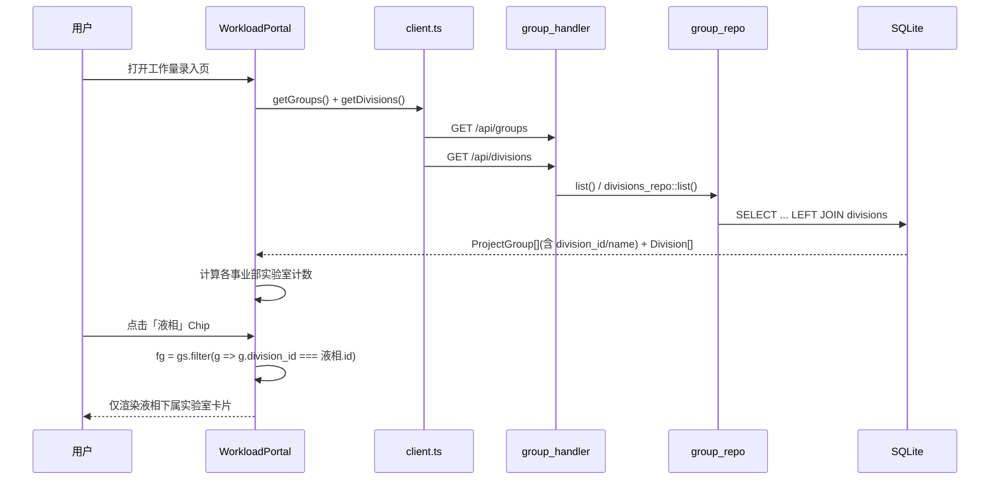
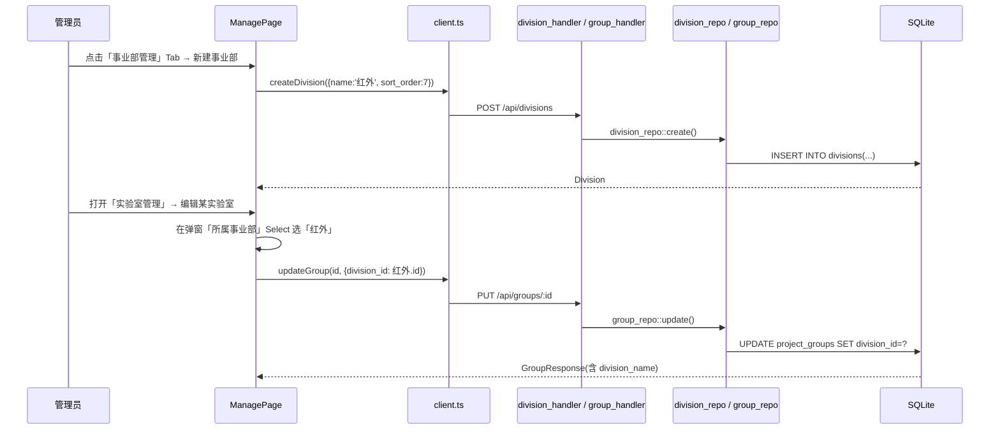
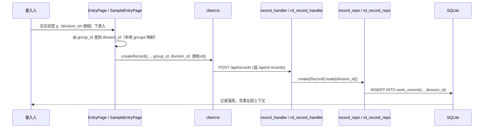

# 事业部层级功能 — 系统架构设计 + 任务分解

> 版本：v0.1（架构设计阶段，只读代码确认）
> 对应设计文档：`design-business-division.md`
> 落地版本：**v0.4.24**（从 v0.4.23 复制后实现）
> 代码基线：`D:\桌面\工作量统计工具项目\workload-tool-rust\v0.4.23`

## TL;DR

在现有「实验室 → 项目/方法 → 记录」三层级之上，新增一级**事业部（Business Division）**主数据表，通过 `project_groups.division_id` 建立 1:N 归属并在 `work_records`/`rd_work_records` 冗余写入 `division_id`，前端在实验室选择页（WorkloadPortal / SamplePortal）复用 EntryPage 已有的 `Chip` 筛选样式做事业部过滤、在管理页（ManagePage）新增事业部 CRUD 与实验室所属下拉，后端沿用现有 Rust Axum + SQLite（rusqlite）与克隆式双线（分析检测 / 研发送样）对称改造，**不引入任何新 crate**。

---

## 1. 实现方案概述 + 框架选型

| 维度 | 决策 | 依据（代码实际） |
|------|------|------------------|
| 后端框架 | **沿用 Rust + Axum 0.7** | `src/main.rs`、`src/api/mod.rs` 已用 `axum::Router::merge`，路由用 `:id` 路径参数（`group_handler.rs:11`） |
| 数据库 | **沿用 SQLite + rusqlite 0.31（bundled）** | `Cargo.toml` 依赖；`src/db/migrations.rs` 用 `execute_batch` + `ALTER TABLE ... ADD COLUMN` 增量迁移 |
| 迁移方式 | **沿用 `migrations.rs` 追加 ALTER/建表** | 历史做法：`ALTER TABLE work_records ADD COLUMN group_id`（v0.3.24）、`method_types` 种子写在同一文件（v0.2.8） |
| 前端框架 | **沿用 React + MUI（TypeScript）** | `frontend/src/pages/*`、`@mui/material` 的 `Chip`/`Select`/`Dialog` 已大量使用 |
| 双线同步 | **克隆式对称改造，不强行抽象** | `src/api/record_handler.rs` 与 `rd_record_handler.rs`、`export_data.rs` 与 `rd_export_data.rs`（`pub use super::export_data::*`）已是镜像结构 |
| 新依赖 | **不需要任何新 crate** | 全部能力（HTTP/JSON/SQLite/Excel）现有依赖已覆盖；事业部仅为新增表 + 字段 + 查询维度 |

**关键确认（基于代码，修正设计草案）**：
- `seed.rs` 中 `ensure_seeded` 已是 **no-op**（v0.2.17 后种子移除），因此 8 类事业部种子应**写入 `migrations.rs`**（与 `method_types`、`sample_info_types` 一致），而非 `seed.rs`。
- `PRAGMA foreign_keys=ON` 全局开启（`migrations.rs:5-6`）。`ALTER TABLE ... ADD COLUMN ... REFERENCES` 在 SQLite 中**只登记约束、不校验旧数据、不要求 NOT NULL**，因此旧实验室 `division_id` 自然为 `NULL`，新插入可写 `NULL` 或合法 `id`。
- `work_records` 有 `multiplier` 列，但 `rd_work_records` **没有 `multiplier`**（导出 rd 侧硬编码 `1.0`）。两条线在事业部改造上结构完全对称，**仅此差异需注意**（不影响 division 改造）。
- 统计聚合（`stats_handler.rs`）为避免笛卡尔积，含实验室名的查询用 `LEFT JOIN project_groups pg ON pg.id = wr.group_id`（单实验室冗余列路径）；事业部维度同理用 `wr.division_id` 冗余列，无需再 JOIN 多层表。

---

## 2. 文件列表（相对路径，v0.4.24 落地为准）

### 后端（新建 / 修改）

| 操作 | 文件路径 | 改动要点 |
|------|----------|----------|
| 改 | `src/db/migrations.rs` | 新增 `divisions` 表 + 8 类种子；`project_groups`/`work_records`/`rd_work_records` 各 `ADD COLUMN division_id` |
| 新建 | `src/models/division.rs` | `Division`、`DivisionResponse`、`DivisionCreate`、`DivisionUpdate` 结构体 |
| 改 | `src/models/group.rs` | `GroupResponse` 增 `division_id`/`division_name`；`GroupCreate`/`GroupUpdate` 增 `division_id` |
| 改 | `src/models/record.rs` | `RecordCreate` 增 `division_id: Option<i64>` |
| 新建 | `src/repo/division_repo.rs` | 事业部 CRUD；删除前检查是否仍有实验室引用（`project_groups.division_id = ?`） |
| 改 | `src/repo/group_repo.rs` | `list`/`get_by_id` 的 SELECT 增加 `LEFT JOIN divisions`；`create`/`update` 写入 `division_id` |
| 改 | `src/repo/record_repo.rs` | `list` 增加 `division_id` 过滤；`create` INSERT 增加 `division_id` 列 |
| 改 | `src/repo/rd_record_repo.rs` | 与 record_repo 对称 |
| 新建 | `src/api/division_handler.rs` | `/api/divisions` GET/POST/PUT/DELETE |
| 改 | `src/api/group_handler.rs` | 无需大改（路由已 `:id`）；仅确保 body 透传 `division_id` |
| 改 | `src/api/record_handler.rs` | `RecordQuery` 增 `division_id`；`create` 透传 `division_id` 到 `RecordCreate` |
| 改 | `src/api/rd_record_handler.rs` | 与 record_handler 对称 |
| 改 | `src/api/stats_handler.rs` | `StatsQuery` 增 `division_id`；新增 `by_division` 端点 |
| 改 | `src/api/rd_stats_handler.rs` | 与 stats_handler 对称 |
| 改 | `src/api/export_data.rs` | P1：各 Sheet 查询增 `division_id` 过滤 + 事业部列（仅 Sheet1/5 等含实验室的表）；新增 `query_sheet_division_summary` |
| 改 | `src/api/rd_export_data.rs` | P1：随 `export_data` 同步，仅换底层表 |
| 改 | `src/api/export_write.rs` | P1：相关 Sheet 写入事业部列 / 汇总 Sheet |
| 改 | `src/api/mod.rs` | 增加 `pub mod division_handler;` 并在 `api_router` 中 `merge(division_handler::router(pool.clone()))` |
| 改 | `src/main.rs` | 无需改（路由在 `api_router` 统一 merge） |

### 前端（新建 / 修改）

| 操作 | 文件路径 | 改动要点 |
|------|----------|----------|
| 改 | `frontend/src/types/index.ts` | 新增 `Division` 接口；`ProjectGroup` 增 `division_id?`/`division_name?`；`WorkRecord` 增 `division_id?` |
| 改 | `frontend/src/api/client.ts` | 新增 `getDivisions`/`createDivision`/`updateDivision`/`deleteDivision`；`createRecord`/`createRdRecord` 入参增 `division_id?` |
| 改 | `frontend/src/pages/WorkloadPortal.tsx` | 在搜索框与卡片网格之间插入事业部 `Chip` 筛选栏（复用 EntryPage 的 Chip 样式） |
| 改 | `frontend/src/pages/SamplePortal.tsx` | 与 WorkloadPortal 同步 |
| 改 | `frontend/src/pages/EntryPage.tsx` | 创建记录时由 `group_id` 推导 `division_id` 传入 `createRecord` |
| 改 | `frontend/src/pages/SampleEntryPage.tsx` | 与 EntryPage 同步 |
| 改 | `frontend/src/pages/ManagePage.tsx` | `TC` 数组新增 `divisions` Tab；事业部列表/新建/编辑/删除 UI；实验室编辑弹窗新增「所属事业部」下拉 |
| 改 | `frontend/src/pages/StatsPage.tsx` | P1：事业部筛选 + 按事业部汇总 |
| 改 | `frontend/src/pages/SampleStatsPage.tsx` | P1：与 StatsPage 同步 |
| 改 | `frontend/src/pages/*.tsx` 相关组件 | 必要时在 `GroupCard`/`components` 复用 Chip 筛选逻辑（建议抽公共组件，见 §8） |

> 约定：本设计所有 `v0.4.23` 路径均指「复制到 `v0.4.24` 后」的实际工作目录。

---

## 3. 数据结构和接口

### 3.1 `divisions` 表最终 DDL

```sql
CREATE TABLE IF NOT EXISTS divisions (
    id          INTEGER PRIMARY KEY AUTOINCREMENT,
    name        TEXT    NOT NULL UNIQUE,
    sort_order  INTEGER NOT NULL DEFAULT 0,
    color       TEXT    NOT NULL DEFAULT '#1976d2',   -- P2 预留
    is_active   INTEGER NOT NULL DEFAULT 1,           -- P2 预留
    deleted_at  TEXT,                                 -- P2 预留（P0 用硬删除+阻止）
    created_at  TEXT    NOT NULL DEFAULT (datetime('now'))
);
CREATE INDEX IF NOT EXISTS idx_divisions_sort ON divisions(sort_order);

-- 种子（v0.4.24）：截图2 那 8 类，sort_order 与截图顺序一致
INSERT OR IGNORE INTO divisions (name, sort_order) VALUES
    ('液相',1),('气相',2),('理化',3),('ICP',4),
    ('热分析',5),('质谱',6),('红外',7),('其他',99);
```

**与 `project_groups` 的关联策略**（关键设计决策）：
- `project_groups.division_id` 用**软关联 + 应用层校验**，外键约束**开启但不强制级联**。
- 删除事业部：**阻止删除**（若仍有 `project_groups.division_id = 该 id`）。理由：避免记录/实验室悬空；符合 `group_repo::delete` 现有「下有项目则阻止」的交互习惯（`group_repo.rs:89-93`）。
- 不采用「ON DELETE SET NULL」自动级联（SQLite 支持，但会让管理员误删后实验室静默失属，且 P0 的「阻止」更安全）。
- 事业部改名/排序直接影响实验室展示与统计分组，无需迁移子表。

### 3.2 `project_groups` 增加 `division_id`

```sql
-- SQLite 支持 ALTER ADD COLUMN，且 REFERENCES 不校验既有行、不要求 NOT NULL
ALTER TABLE project_groups ADD COLUMN division_id INTEGER REFERENCES divisions(id);
CREATE INDEX IF NOT EXISTS idx_groups_division ON project_groups(division_id);
```

旧实验室：`division_id = NULL` → 前端显示「未分配事业部」（见 §9 待确认 3，本设计推荐 `NULL` 而非 `0`）。

### 3.3 `work_records` / `rd_work_records` 增加 `division_id`

```sql
-- 冗余快照：录入时锁定写入，历史记录可按原事业部统计，不受后续实验室改属影响
ALTER TABLE work_records      ADD COLUMN division_id INTEGER REFERENCES divisions(id);
ALTER TABLE rd_work_records   ADD COLUMN division_id INTEGER REFERENCES divisions(id);
CREATE INDEX IF NOT EXISTS idx_records_division      ON work_records(division_id);
CREATE INDEX IF NOT EXISTS idx_rd_records_division   ON rd_work_records(division_id);
```

> 注：`rd_work_records` 无 `multiplier`，但 `division_id` 加列与 work 完全一致。

### 3.4 关键结构体定义（Rust 侧）

`src/models/division.rs`（新建）：

```rust
use serde::{Deserialize, Serialize};

#[derive(Debug, Serialize)]
pub struct Division {
    pub id: i64,
    pub name: String,
    pub sort_order: i64,
    pub color: String,
    pub is_active: bool,
    pub created_at: String,
}

#[derive(Debug, Serialize)]
pub struct DivisionResponse {
    pub id: i64,
    pub name: String,
    pub sort_order: i64,
    pub lab_count: i64,      // 下属实验室数量（列表接口聚合）
    pub color: String,
    pub is_active: bool,
}

#[derive(Debug, Deserialize)]
pub struct DivisionCreate {
    pub name: String,
    pub sort_order: Option<i64>,
    pub color: Option<String>,
}

#[derive(Debug, Deserialize)]
pub struct DivisionUpdate {
    pub name: Option<String>,
    pub sort_order: Option<i64>,
    pub color: Option<String>,
}
```

`src/models/group.rs`（修改 `GroupResponse` / `GroupCreate` / `GroupUpdate`）：

```rust
pub struct GroupResponse {
    pub id: i64,
    pub name: String,
    pub sort_order: i64,
    pub created_at: String,
    pub project_count: i64,
    pub project_names: Option<String>,
    pub rd_record_count: Option<i64>,
    pub show_in_work: bool,
    pub show_in_rd: bool,
    pub division_id: Option<i64>,     // 新增
    pub division_name: Option<String>,// 新增（JOIN divisions 得到）
}

pub struct GroupCreate {
    pub name: String,
    pub sort_order: Option<i64>,
    pub show_in_work: Option<bool>,
    pub show_in_rd: Option<bool>,
    pub division_id: Option<i64>,     // 新增
}

pub struct GroupUpdate {
    pub name: Option<String>,
    pub sort_order: Option<i64>,
    pub show_in_work: Option<bool>,
    pub show_in_rd: Option<bool>,
    pub division_id: Option<i64>,     // 新增
}
```

`src/models/record.rs`（修改 `RecordCreate`）：

```rust
pub struct RecordCreate {
    pub project_id: i64,
    pub method_id: Option<i64>,
    pub user_name: String,
    pub quantity: i32,
    pub recorded_at: String,
    pub group_id: Option<i64>,
    pub multiplier: Option<f64>,
    pub division_id: Option<i64>,   // 新增
}
```

（`RecordQuery` 在 handler 内定义，增 `division_id: Option<i64>`；`StatsQuery` 同样增加。）

### 3.5 前端类型

`frontend/src/types/index.ts`：

```ts
export interface Division {
  id: number;
  name: string;
  sort_order: number;
  lab_count?: number;
  color?: string;
  is_active?: boolean;
}
// ProjectGroup 增加：
//   division_id?: number;
//   division_name?: string;
// WorkRecord 增加：
//   division_id?: number;
```

---

## 4. 程序调用流程（Mermaid 时序图）

### 4.1 用户在实验室选择页点击某事业部 Chip → 卡片过滤



### 4.2 管理员在管理页新建事业部并指派实验室



### 4.3 录入记录时写入 division_id（双线对称）



---

## 5. API 接口清单

> 统一响应结构：`ApiResponse<T>`（`{ code:0, message:"ok", data? }`），分页 `PaginatedResponse<T>`（`src/models/mod.rs:16-39`）。

### 5.1 事业部（`division_handler.rs`）

| 方法 | 路径 | 请求 | 响应 |
|------|------|------|------|
| GET | `/api/divisions` | — | `ApiResponse<DivisionResponse[]>`（含 `lab_count`） |
| POST | `/api/divisions` | `DivisionCreate {name, sort_order?, color?}` | `ApiResponse<DivisionResponse>` |
| PUT | `/api/divisions/:id` | `DivisionUpdate {name?, sort_order?, color?}` | `ApiResponse<DivisionResponse>` |
| DELETE | `/api/divisions/:id` | — | `ApiResponse<()>`（下有实验室则 `409 Conflict`，消息「请先迁移或删除下属实验室」） |

示例（GET 返回）：
```json
{
  "code": 0, "message": "ok",
  "data": [
    {"id":1,"name":"液相","sort_order":1,"lab_count":3,"color":"#1976d2","is_active":true},
    {"id":8,"name":"其他","sort_order":99,"lab_count":5,"color":"#1976d2","is_active":true}
  ]
}
```

### 5.2 实验室（`group_handler.rs` / `group_repo.rs`）

- `GET /api/groups` → `GroupResponse[]` 各元素新增 `division_id`、`division_name`。
- `POST /api/groups`、`PUT /api/groups/:id` → 入参新增 `division_id?: number`（透传写入）。

### 5.3 记录（`record_handler.rs` / `rd_record_handler.rs`）

- `RecordQuery` 新增 `division_id?: number`（列表按事业部过滤）。
- `POST /api/records` / `POST /api/rd-records` → `RecordCreate` 新增 `division_id?: number`，落库 `work_records.division_id` / `rd_work_records.division_id`。

```json
// POST /api/records 请求体（新增字段）
{
  "project_id": 12, "method_id": 5, "user_name": "张三",
  "quantity": 3, "recorded_at": "2026-07-09T10:00",
  "group_id": 410, "division_id": 1
}
```

### 5.4 统计（`stats_handler.rs` / `rd_stats_handler.rs`）

| 方法 | 路径 | 说明 |
|------|------|------|
| GET | `/api/stats/by-division` | 新增，按 `wr.division_id` 汇总（P0） |
| GET | `/api/rd-stats/by-division` | 研发送样对应端点（P0） |
| GET | 现有 `summary/by-user/by-project/by-type/by-instrument` | `StatsQuery` 增加 `division_id` 过滤参数（P1，可选） |

`StatsQuery` 增加 `division_id?: number`。`by_division` 返回结构（新增 `DivisionStats`）：

```rust
#[derive(Serialize)]
pub struct DivisionStats {
    pub division_id: Option<i64>,
    pub division_name: String,       // NULL → "未分配事业部"
    pub total_quantity: i64,
    pub record_count: i64,
    pub coefficient_score: f64,
}
```

SQL 骨架（work 侧，`rd` 仅换表名与 `coeff_sql`）：
```sql
SELECT COALESCE(d.id, -1)            AS division_id,
       COALESCE(d.name, '未分配事业部') AS division_name,
       SUM(wr.quantity), COUNT(*), <coeff_sql>
FROM work_records wr
LEFT JOIN divisions d ON d.id = wr.division_id
WHERE wr.deleted_at IS NULL AND <date_where>
GROUP BY d.id ORDER BY d.sort_order;
```

> 注意：`by_division` 直接走 `wr.division_id` 冗余列，**不 JOIN `project_lab_links`**，避免笛卡尔积（与 `by_project` 用 `wr.group_id` 同思路，`stats_handler.rs:201-207`）。

### 5.5 导出（`export_data.rs` / `rd_export_data.rs`，P1）

- 各含实验室维度的 Sheet（Sheet1/4/5/7 等）SELECT 增加 `LEFT JOIN divisions d ON d.id = wr.division_id` 取 `d.name AS division_name`，并在行结构增加 `division` 字段。
- `query_sheet1_data` / `query_sheet5_data` 等增加 `division_id?: number` 过滤参数（传入后 `AND wr.division_id = ?` 或 `IS NULL`）。
- `rd_export_data.rs` 因 `pub use super::export_data::*` 复用类型与 `write_sheetN`，仅需把底层 `work_records` 替换为 `rd_work_records`（参考现有 Sheet 写法 diff）。
- 独立「事业部汇总 Sheet」为 **P2**，暂不实现。

---

## 6. 任务列表（核心交付，按实现顺序排列）

> 粒度：一个「文件组」内可一次完成。依赖指必须在其后执行。
> 阶段标记：**[P0]** 最小可用 / **[P1]** 应做 / **[P2]** 预留。

| # | 任务 | 涉及文件 | 改动要点 | 依赖 |
|---|------|----------|----------|------|
| T1 | **[P0] 建表与迁移** | `src/db/migrations.rs` | 新增 `divisions` 表 + 8 类种子；三表 `ADD COLUMN division_id` + 索引 | — |
| T2 | **[P0] 事业部模型** | `src/models/division.rs`（新）, `src/models/mod.rs` | 定义 `Division`/`DivisionResponse`/`DivisionCreate`/`DivisionUpdate`；mod 注册 | T1 |
| T3 | **[P0] 事业部 Repo** | `src/repo/division_repo.rs`（新） | `list`/`create`/`update`/`delete`（删除前查 `project_groups.division_id` 计数，>0 则 `Conflict`） | T2 |
| T4 | **[P0] 事业部 Handler** | `src/api/division_handler.rs`（新）, `src/api/mod.rs`, `src/main.rs`(间接) | 4 个端点；`api/mod.rs` 加 `pub mod division_handler` 并 `merge` 到 `api_router` | T3 |
| T5 | **[P0] Group 模型+Repo 改造** | `src/models/group.rs`, `src/repo/group_repo.rs` | `GroupResponse` 增 `division_id`/`division_name`（SELECT 加 `LEFT JOIN divisions`）；`create`/`update` 写 `division_id` | T1 |
| T6 | **[P0] Record 模型+Repo 双线改造** | `src/models/record.rs`, `src/repo/record_repo.rs`, `src/repo/rd_record_repo.rs` | `RecordCreate` 增 `division_id`；两 repo 的 `create` INSERT 增列；`list` 增 `division_id` 过滤 | T1 |
| T7 | **[P0] Record Handler 双线透传** | `src/api/record_handler.rs`, `src/api/rd_record_handler.rs` | `RecordQuery` 增 `division_id`；`create` 透传到 `RecordCreate` | T6 |
| T8 | **[P0] 前端类型与 API** | `frontend/src/types/index.ts`, `frontend/src/api/client.ts` | `Division` 接口；`ProjectGroup`/`WorkRecord` 增字段；新增 `getDivisions` 等 4 个函数；`createRecord`/`createRdRecord` 入参增 `division_id?` | T4,T5 |
| T9 | **[P0] 实验室选择页 Chip 筛选** | `frontend/src/pages/WorkloadPortal.tsx`, `SamplePortal.tsx` | 搜索框与卡片间插入事业部 `Chip` 栏（复用 EntryPage 的 `Chip` 样式：`filled`/`outlined`、`borderRadius:'2px'`、`fontWeight` 高亮），计数叠加搜索过滤 | T8 |
| T10 | **[P0] 录入页写入 division_id** | `frontend/src/pages/EntryPage.tsx`, `SampleEntryPage.tsx` | 进入页时由 `groupId` 在 `groups` 映射出 `division_id`，`createRecord` 时传入 | T8 |
| T11 | **[P0] 管理页事业部 CRUD + 实验室下拉** | `frontend/src/pages/ManagePage.tsx` | `TC` 增加 `{key:'divisions',...}`；事业部列表/新建/编辑/删除（复用 method type 的 Dialog 模式）；实验室编辑弹窗「所属事业部」`Select`+`MenuItem`（含「未分配」项） | T8 |
| T12 | **[P1] 统计 by_division** | `src/api/stats_handler.rs`, `src/api/rd_stats_handler.rs`, `src/models/stats`（或各 handler 内） | 新增 `by_division` 端点（SQL 见 §5.4）；`StatsQuery` 增 `division_id` 过滤 | T6 |
| T13 | **[P1] 统计前端筛选** | `frontend/src/pages/StatsPage.tsx`, `SampleStatsPage.tsx` | 接入 `getStatsByDivision`/`getRdStatsByDivision` + 事业部筛选器 | T12 |
| T14 | **[P1] 导出事业部维度** | `src/api/export_data.rs`, `src/api/rd_export_data.rs`, `src/api/export_write.rs`, `frontend/src/types/index.ts`（Sheet 行类型增 `division`） | 含实验室 Sheet 增 `division_name` 列与 `division_id` 过滤；rd 复用 | T6 |
| T15 | **[P2] 预留列生效（颜色/软删除/独立汇总 Sheet）** | `divisions`/`export_*` | 颜色 Chip、软删除 `deleted_at`、事业部汇总 Sheet（数据模型已预留列，无需改表） | T4,T14 |

**实现顺序建议**：T1→T2→T3→T4（后端主数据闭环）→ T5→T6→T7（双线记录落地）→ T8→T9→T10→T11（前端）→ T12→T13→T14（P1 统计/导出）→ T15（P2）。T9/T10/T11 可与 T12 并行（不同文件组）。

---

## 7. 依赖包列表

**无需新增任何 crate。** 现有依赖已完全覆盖：

- HTTP/路由：`axum 0.7`、`tokio`、`tower-http`、`tower`
- 序列化：`serde`、`serde_json`
- 数据库：`rusqlite 0.31 (bundled)`、`r2d2`、`r2d2_sqlite`
- 时间：`chrono`；日志：`tracing*`；错误：`thiserror`、`anyhow`
- Excel：导出 `rust_xlsxwriter`、导入 `calamine`；文档/图像：`quick-xml`、`pdf-extract`、`zip`、`image`、`base64`
- 工具：`regex`、`uuid`、`validator`、`url-escape`、`toml`、`crossbeam-channel`、`open`
- 文档：`utoipa 4`（可选，本功能不强制加注解）
- 前端：React + MUI（`@mui/material` 的 `Chip`/`Select`/`Dialog`/`MenuItem` 均已使用）

---

## 8. 共享知识（跨文件约定）

1. **`division_id` 在两条业务线的对称传递**
   - 录入侧：`EntryPage`/`SampleEntryPage` 用 `groupId` 在本地 `groups` 列表映射出 `division_id`，再传给 `createRecord`/`createRdRecord`；后端 `RecordCreate.division_id` → `record_repo`/`rd_record_repo` 的 `create` INSERT。
   - 查询侧：所有过滤统一走 `wr.division_id`（冗余列），**不走 `project_lab_links`**，避免笛卡尔积。
   - 一致性自检：对 `record_*` 与 `rd_record_*` 两份文件做 diff，确保 `division_id` 出现位置完全对称。

2. **推荐辅助函数 `division_filter_sql`**（放在 `src/api/stats_handler.rs` 与 `rd_stats_handler.rs` 各一份，或抽到共享模块）
   ```rust
   fn division_filter_sql(division_id: Option<i64>) -> String {
       match division_id {
           None => String::new(),
           Some(-1) => " AND wr.division_id IS NULL".to_string(), // -1 约定=未分配
           Some(id) => format!(" AND wr.division_id = {}", id),
       }
   }
   ```
   > 注意：所有动态拼接的参数均为**服务端枚举/整数 id**（前端传入的是 `Option<i64>`），非用户输入字符串，无注入风险；与现有 `build_where`/`exists_clause` 风格一致（`stats_handler.rs:80-86,117-121`）。

3. **前端 Chip 筛选复用组件位置**
   - 现有方法类型 Chip 实现见 `EntryPage.tsx:182-200`（`typeFilter` 状态 + `Chip` 列表，`variant={filled/outlined}`、`borderRadius: R`、`fontWeight` 高亮）。
   - 建议将「事业部 Chip 栏」抽为 `frontend/src/components/DivisionChips.tsx`，`WorkloadPortal` 与 `SamplePortal` 共用，避免两份重复逻辑（与「克隆式但可抽公共组件」原则一致：数据链路克隆，纯 UI 筛选组件复用）。

4. **「未分配事业部」展示约定**
   - 后端：SQL 用 `COALESCE(d.name, '未分配事业部')`；统计未分配用 `division_id IS NULL`。
   - 前端：`division_id` 为 `null/undefined` 时显示「未分配事业部」；事业部 Chip 栏的「全部」固定 `id=0`（仅前端聚合用，不等于数据库 `0`）。

5. **`GroupResponse` 的 `division_name` 来源**：`group_repo` 的 `list`/`get_by_id` SELECT 增加
   ```sql
   (SELECT d.name FROM divisions d WHERE d.id = g.division_id) AS division_name
   ```
   或在 `FROM` 中 `LEFT JOIN divisions d ON d.id = g.division_id` 后取 `d.name`（与现有 `show_in_work/show_in_rd` 同 SELECT 列表追加，注意 `row.get` 索引顺延）。

---

## 9. 待明确事项（设计中仍不确定 / 需再次拍板的技术点）

1. **外键是否真正启用校验**：`PRAGMA foreign_keys=ON` 已全局开启。`ADD COLUMN ... REFERENCES divisions(id)` 后，若某次写入 `division_id` 指向不存在的 id 会报 FK 错误。建议：仅允许写入 `NULL` 或已存在 `divisions.id`；删除事业部走「阻止」而非级联，规避悬空。是否接受此策略？
2. **旧数据 `division_id` 表示方式**：本设计推荐 `NULL`（前端显示「未分配事业部」），**不创建** `id=0` 的特殊「未分配」行（因外键开启时 `0` 若不在 `divisions` 表会冲突）。是否同意用 `NULL` 而非 `0`？
3. **迁移对旧记录的回填 SQL**：P0 默认**不回填**——旧实验室 `division_id=NULL`（归入未分配），旧记录 `division_id=NULL`。是否需要在迁移脚本里按截图2的 8 类做**启发式自动归属**（如按 `project_groups.name` 含「液相」字样匹配）？本设计建议**不自动归属**，交由管理员在 ManagePage 批量指派，避免误判。
4. **`division_id` 冗余写入的时机**：录入时若 `group_id` 已知但对应 `division_id` 为 `NULL`（实验室未指派事业部），记录 `division_id` 也写 `NULL`。是否接受「实验室未属事业部 → 记录也无事业部」的级联空值？
5. **前端 Chip「全部」计数语义**：`全部 (n)` 的 `n` 是指实验室总数还是事业部数？设计文档示例「全部 (8)」像是事业部数量。需确认 `全部` 后的数字含义（本设计按「当前搜索条件下实验室总数」实现，与「液相 (3)」= 该事业部实验室数对齐）。

---

## 10. 版本隔离落地说明

本功能作为**独立版本 `v0.4.24`** 实现，严格隔离于稳定基线 `v0.4.23`：

1. **复制目录**：将 `D:\桌面\工作量统计工具项目\workload-tool-rust\v0.4.23\` 整目录复制为同级的 `v0.4.24\`（保留 `v0.4.23` 不动，作为可回滚基线）。
2. **本设计所有改动路径均指 `v0.4.24` 内**的相对路径（上文 §2 文件列表、§6 任务列表中的路径即落地路径）。
3. **版本号**：升级 `Cargo.toml` 与 `frontend/package.json` 的版本为 `0.4.24`；构建产物独立。
4. **CHANGELOG**：新增 `CHANGELOG_v0.4.24.md` 记录本次变更（参考现有 `CHANGELOG_v0.4.23.md` 格式）。
5. **禁止在 `v0.4.23` 原地修改**；本架构设计阶段亦**全只读**，未触碰任何源码。
6. **回归重点**：完成后端双线（work/rd）导出与统计一致性端到端测试，确认 `division_id` 在两套 `export_data`/`rd_export_data` 中对称生效。

---

## 进入工程实现前的最后确认清单

1. **外键与旧数据策略**：是否确认 `division_id = NULL` 表示「未分配」，且删除事业部采用「阻止删除（下有实验室时 409）」而非级联置空？（§9-1、§9-2）
2. **是否自动归属旧数据**：是否确认 P0 不自动启发式回填，旧实验室/记录统一 `NULL`，由管理员在 ManagePage 指派？（§9-3）
3. **P0 范围边界**：是否确认 P0 不含「导出事业部列 / 独立汇总 Sheet / 颜色 / 软删除」，仅做「表+种子+选择页 Chip+记录写 division_id+管理页 CRUD+双线同步」？（决策 #4）
4. **Chip「全部」计数语义**：「全部 (n)」的 `n` 是实验室总数还是事业部数？（§9-5）
5. **v0.4.24 复制确认**：是否已从 `v0.4.23` 复制出 `v0.4.24` 目录，且全部开发在其内进行？（§10）
