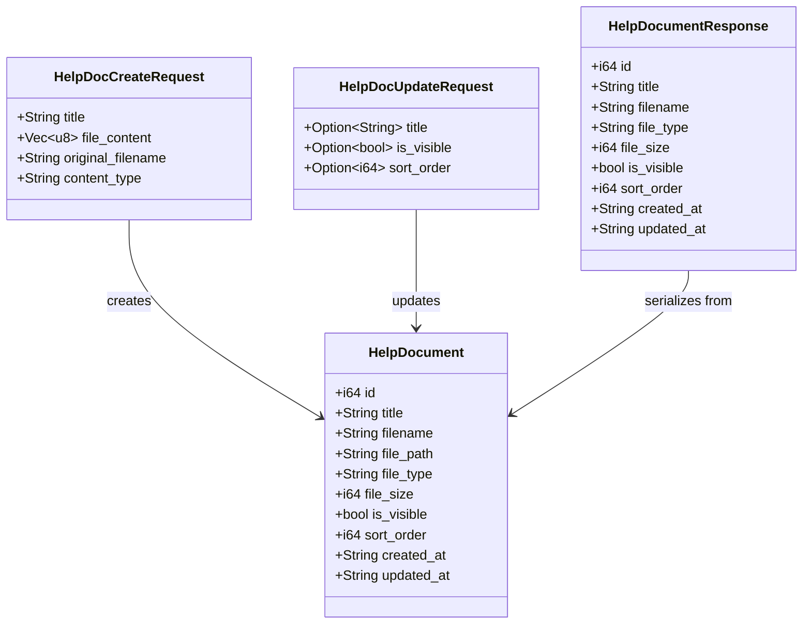
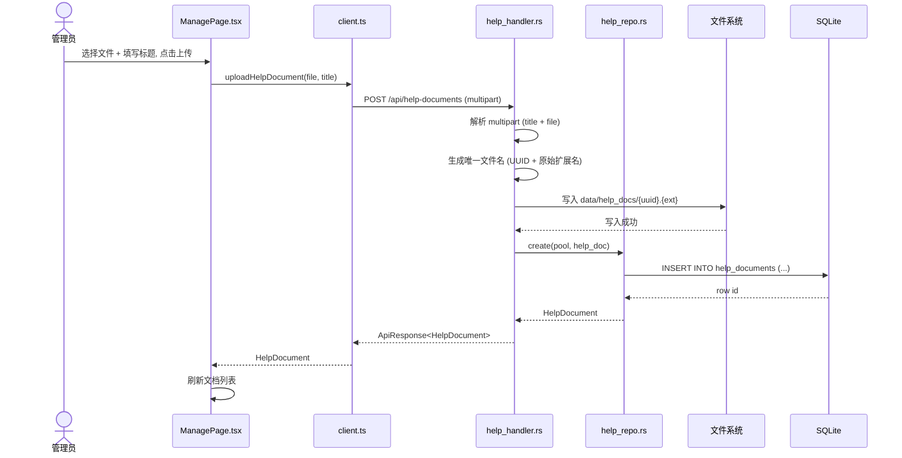
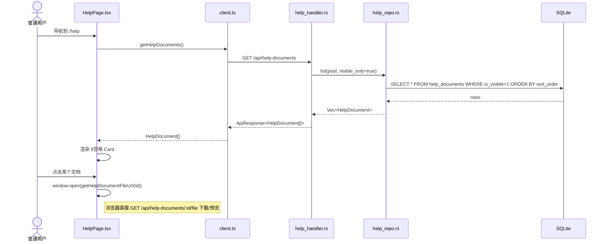
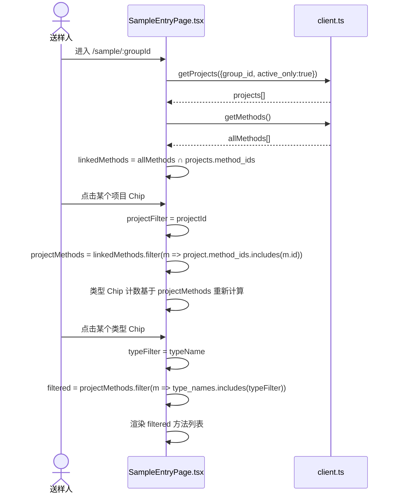
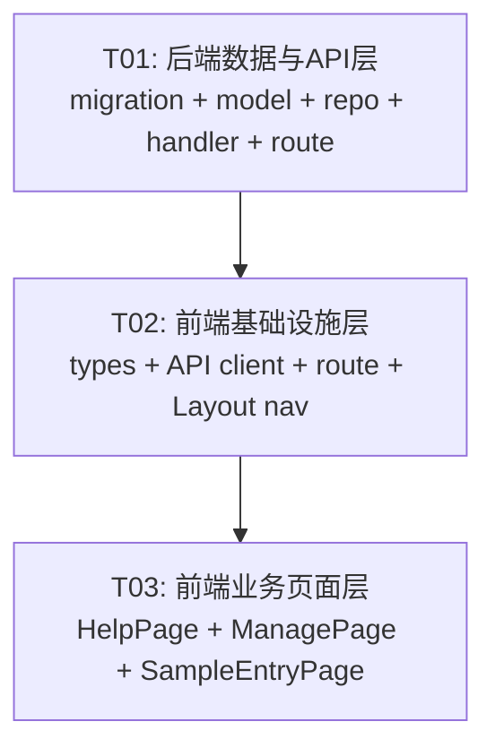

# v0.4.11 系统设计文档

> Architect: Bob | Date: 2025-07-16 | 技术栈: Rust (Axum 0.7) + rusqlite + React (Vite + MUI + Tailwind)

---

## 目录

1. [实现方案](#1-实现方案)
2. [文件列表](#2-文件列表)
3. [数据结构和接口](#3-数据结构和接口)
4. [程序调用流程](#4-程序调用流程)
5. [待明确事项](#5-待明确事项)
6. [依赖包列表](#6-依赖包列表)
7. [任务列表](#7-任务列表)
8. [共享知识](#8-共享知识)
9. [任务依赖图](#9-任务依赖图)

---

## 1. 实现方案

### 1.1 核心挑战分析

| 挑战 | 分析 | 方案 |
|------|------|------|
| 帮助文档的文件存储 | 需在本地文件系统持久化上传文件 | 在 `data/help_docs/` 目录存储，数据库仅记录元数据和相对路径 |
| 多文件上传支持 | axum 已启用 `multipart` feature | 沿用现有 `methodImport` 的 multipart 处理模式 |
| 9宫格卡片布局 | 需响应式且美观 | MUI Grid + Card，3列网格，mobile 1列 |
| SampleEntryPage 项目筛选联动 | 项目选择 → 方法过滤 → 类型标签计数联动 | 三层 `useMemo`：projectFilter → linkedMethods → filtered + type counts |
| 管理页文档管理 | 新增 tab + CRUD 操作 | 复用 ManagePage 现有模式（InlineEditCard + Dialog + ConfirmDialog） |

### 1.2 框架和库选型

| 层 | 技术 | 说明 |
|----|------|------|
| 后端 HTTP | Axum 0.7 | 已有，无需变更 |
| 数据库 | rusqlite 0.31 (bundled) | 已有 |
| 序列化 | serde + serde_json | 已有 |
| 文件上传 | axum multipart | 已启用 feature |
| 前端框架 | React 18 + TypeScript 5.3 | 已有 |
| UI 组件 | MUI 5.14 + Emotion | 已有 |
| 路由 | react-router-dom 6.20 | 已有 |
| 样式 | Tailwind CSS 3.4 | 已有 |
| HTTP 客户端 | axios 1.6 | 已有 |

**结论**：本次迭代不引入任何新依赖，完全复用现有技术栈。

### 1.3 架构模式

沿用现有三层架构（Handler → Repo → DB），不做任何架构变更：

```
┌──────────────────────────────────────────┐
│  axum Router (src/api/mod.rs)            │
│  ┌────────────┐ ┌──────────────────────┐ │
│  │ 现有 14 个  │ │ help_handler (新增)   │ │
│  │ handler    │ │ CRUD + 文件下载       │ │
│  └────────────┘ └──────────────────────┘ │
├──────────────────────────────────────────┤
│  Repo Layer (src/repo/)                  │
│  ┌────────────┐ ┌──────────────────────┐ │
│  │ 现有 repo  │ │ help_repo (新增)      │ │
│  └────────────┘ └──────────────────────┘ │
├──────────────────────────────────────────┤
│  Models (src/models/)                    │
│  ┌────────────┐ ┌──────────────────────┐ │
│  │ 现有 model │ │ help.rs (新增)        │ │
│  └────────────┘ └──────────────────────┘ │
├──────────────────────────────────────────┤
│  SQLite (via rusqlite + r2d2)            │
│  ┌────────────────┐ ┌──────────────────┐ │
│  │ 现有表 (不变)   │ │ help_documents   │ │
│  └────────────────┘ └──────────────────┘ │
└──────────────────────────────────────────┘
```

---

## 2. 文件列表

### 2.1 后端文件 (src/)

| # | 文件路径 | 操作 | 说明 |
|---|----------|------|------|
| 1 | `src/models/help.rs` | **CREATE** | help_documents 数据模型（Request/Response struct） |
| 2 | `src/models/mod.rs` | **MODIFY** | 添加 `pub mod help;` |
| 3 | `src/repo/help_repo.rs` | **CREATE** | help_documents 数据访问层（CRUD + 文件管理） |
| 4 | `src/repo/mod.rs` | **MODIFY** | 添加 `pub mod help_repo;` |
| 5 | `src/api/help_handler.rs` | **CREATE** | help_documents REST API handler（含 multipart 上传 + 文件下载） |
| 6 | `src/api/mod.rs` | **MODIFY** | 注册 `help_handler::router()` 到 `.merge()` |
| 7 | `src/db/migrations.rs` | **MODIFY** | 添加 `help_documents` 表创建语句 |

### 2.2 前端文件 (frontend/src/)

| # | 文件路径 | 操作 | 说明 |
|---|----------|------|------|
| 8 | `frontend/src/types/index.ts` | **MODIFY** | 添加 `HelpDocument` 接口 |
| 9 | `frontend/src/api/client.ts` | **MODIFY** | 添加 4 个帮助文档 API 函数 |
| 10 | `frontend/src/App.tsx` | **MODIFY** | 添加 `<Route path="/help" element={<HelpPage />} />` |
| 11 | `frontend/src/components/Layout.tsx` | **MODIFY** | NAV_ITEMS / MOBILE_NAV 加 "教程与帮助" 项 |
| 12 | `frontend/src/pages/HelpPage.tsx` | **CREATE** | 9宫格卡片布局的教程与帮助页面 |
| 13 | `frontend/src/pages/ManagePage.tsx` | **MODIFY** | TC 数组添加 help tab + 文档管理 UI |
| 14 | `frontend/src/pages/SampleEntryPage.tsx` | **MODIFY** | 添加项目选择 Chip 栏 + 联动过滤 |

---

## 3. 数据结构和接口

### 3.1 Rust 数据模型



### 3.2 SQL 表结构

```sql
CREATE TABLE IF NOT EXISTS help_documents (
    id INTEGER PRIMARY KEY AUTOINCREMENT,
    title TEXT NOT NULL,
    filename TEXT NOT NULL,
    file_path TEXT NOT NULL,
    file_type TEXT NOT NULL,
    file_size INTEGER NOT NULL DEFAULT 0,
    is_visible INTEGER NOT NULL DEFAULT 1,
    sort_order INTEGER NOT NULL DEFAULT 0,
    created_at TEXT NOT NULL DEFAULT (datetime('now','localtime')),
    updated_at TEXT NOT NULL DEFAULT (datetime('now','localtime'))
);
```

### 3.3 API 端点

| 方法 | 路径 | Handler | 认证 | 说明 |
|------|------|---------|------|------|
| `GET` | `/api/help-documents` | `list` | 否 | 获取可见文档列表（`?all=true` 返回全部含隐藏） |
| `GET` | `/api/help-documents/:id` | `get_one` | 否 | 获取单个文档元数据 |
| `GET` | `/api/help-documents/:id/file` | `download` | 否 | 下载/预览文件（返回文件流） |
| `POST` | `/api/help-documents` | `create` | 是(admin) | multipart 上传文档（title + file） |
| `PUT` | `/api/help-documents/:id` | `update` | 是(admin) | 更新文档元数据（title, is_visible, sort_order） |
| `DELETE` | `/api/help-documents/:id` | `delete` | 是(admin) | 删除文档（DB + 文件系统） |

### 3.4 TypeScript 类型

```typescript
// 新增到 frontend/src/types/index.ts
export interface HelpDocument {
  id: number;
  title: string;
  filename: string;
  file_type: string;
  file_size: number;
  is_visible: boolean;
  sort_order: number;
  created_at: string;
  updated_at: string;
}
```

### 3.5 前端 API 客户端函数签名

```typescript
// 新增到 frontend/src/api/client.ts
export const getHelpDocuments = (all?: boolean): Promise<ApiResponse<HelpDocument[]>> =>
  client.get('/help-documents', { params: { all } }).then(r => r.data);

export const uploadHelpDocument = (file: File, title: string): Promise<ApiResponse<HelpDocument>> => {
  const fd = new FormData();
  fd.append('file', file);
  fd.append('title', title);
  return client.post('/help-documents', fd, { headers: { 'Content-Type': 'multipart/form-data' } }).then(r => r.data);
};

export const updateHelpDocument = (id: number, data: { title?: string; is_visible?: boolean; sort_order?: number }): Promise<ApiResponse<HelpDocument>> =>
  client.put(`/help-documents/${id}`, data).then(r => r.data);

export const deleteHelpDocument = (id: number): Promise<ApiResponse<null>> =>
  client.delete(`/help-documents/${id}`).then(r => r.data);

export const getHelpDocumentFileUrl = (id: number): string => `/api/help-documents/${id}/file`;
```

---

## 4. 程序调用流程

### 4.1 上传帮助文档



### 4.2 用户查看帮助页面



### 4.3 SampleEntryPage 项目筛选联动



---

## 5. 待明确事项

| # | 事项 | 假设 | 风险 |
|---|------|------|------|
| 1 | 帮助文档存储在哪？ | `{exe所在目录}/data/help_docs/`，与 DB 同级 | 需确保目录存在且可写 |
| 2 | 是否需要 admin token 校验 | POST/PUT/DELETE 假设不需要后端校验（管理页已有前端认证），仅标记 `是(admin)` | 如需后端校验，需读取 request header 中的 token |
| 3 | help_documents 文件上限 | 单文件 50MB，无总量限制 | 后期可能需清理逻辑 |
| 4 | 研发送样项目筛选是否需要持久化 | 不需要，仅作为前端瞬时筛选状态 | 无 |

---

## 6. 依赖包列表

**无新增依赖。** 本次迭代完全复用现有依赖：

- Rust: axum (multipart)、rusqlite、serde、uuid — 全部已有
- Frontend: React 18、MUI 5.14、react-router-dom 6.20、axios — 全部已有

---

## 7. 任务列表

### T01: 后端数据与 API 层 (P0)

**Task ID**: T01
**Task Name**: 后端数据与 API 层 — help_documents 完整后端实现
**Source Files**:
- `src/db/migrations.rs` (MODIFY) — 添加 `help_documents` 建表语句
- `src/models/help.rs` (CREATE) — 数据模型 struct（HelpDocument, HelpDocCreateRequest, HelpDocUpdateRequest）
- `src/models/mod.rs` (MODIFY) — 注册 `pub mod help;`
- `src/repo/help_repo.rs` (CREATE) — 数据访问层（list / get_by_id / create / update / delete）
- `src/repo/mod.rs` (MODIFY) — 注册 `pub mod help_repo;`
- `src/api/help_handler.rs` (CREATE) — REST handler（multipart 上传 + 文件下载 + CRUD）
- `src/api/mod.rs` (MODIFY) — `.merge(help_handler::router(pool.clone()))`

**Dependencies**: 无
**Priority**: P0
**说明**: 这是所有后续任务的基础，必须先完成。涵盖 DB 迁移、数据模型、数据访问层、API handler 和路由注册的完整后端链路。

---

### T02: 前端基础设施层 (P0)

**Task ID**: T02
**Task Name**: 前端基础设施 — 类型定义、API 客户端、路由、导航入口
**Source Files**:
- `frontend/src/types/index.ts` (MODIFY) — 添加 `HelpDocument` 接口
- `frontend/src/api/client.ts` (MODIFY) — 添加 `getHelpDocuments` / `uploadHelpDocument` / `updateHelpDocument` / `deleteHelpDocument` / `getHelpDocumentFileUrl`
- `frontend/src/App.tsx` (MODIFY) — 添加 `<Route path="/help" element={<HelpPage />} />` + import
- `frontend/src/components/Layout.tsx` (MODIFY) — NAV_ITEMS 和 MOBILE_NAV 添加 `{ label: '教程与帮助', path: '/help', icon: <HelpIcon /> }`，同时添加 `import HelpIcon`

**Dependencies**: T01（需要知道 API 端点路径和响应格式）
**Priority**: P0
**说明**: 建立前端与后端之间的约定。类型定义和 API 客户端是前后端契约，路由和导航是用户可达入口。

---

### T03: 前端业务页面层 (P0)

**Task ID**: T03
**Task Name**: 前端业务页面 — HelpPage + ManagePage 文档管理 + SampleEntryPage 项目筛选
**Source Files**:
- `frontend/src/pages/HelpPage.tsx` (CREATE) — 9宫格 Card 布局，显示可见文档，点击打开/下载
- `frontend/src/pages/ManagePage.tsx` (MODIFY) — TC 数组添加 `{ key: 'help', label: '教程与帮助', icon: <HelpIcon />, desc: '...' }`；添加 help tab 下的文档管理 UI（上传 Dialog、文档列表 InlineEditCard、显隐 Chip、删除按钮）
- `frontend/src/pages/SampleEntryPage.tsx` (MODIFY) — 添加 `projectFilter` state 和项目 Chip 选择栏（在类型筛选栏上方）；修改 `linkedMethods` → `projectFilteredMethods` → `filtered` 三层 useMemo 联动；类型 Chip 计数基于项目过滤后的方法

**Dependencies**: T02（需要类型定义和 API 函数）
**Priority**: P0
**说明**: 所有面向用户的功能页面。HelpPage 是独立新页面，ManagePage 在管理后台新增 help tab，SampleEntryPage 在前端添加项目筛选交互。

---

## 8. 共享知识

```
- API 响应格式: { code: 0, message: "ok", data: T } 或 { code: 非零, message: "错误信息", data: null }
- 错误处理: 后端所有 handler 返回 Result<Json<ApiResponse<T>>>，AppError 自动转 HTTP 200 + 业务 error code
- 数据库时间: 统一使用 datetime('now','localtime') 格式，即本地时间
- 事务约定: 写操作（create/update/delete）使用 conn.execute()，无需手动管理事务（rusqlite 单连接模式）
- 文件存储: help_docs 目录与 DB 文件同级，路径通过 AppConfig 计算
- 管理认证: 目前仅前端通过 sessionStorage token 控制入口，后端 help handler 的 CUD 操作建议也加入基本校验
- 代码风格: 
  - Rust: 2-space indent, snake_case, mod.rs 中 pub mod 声明
  - TypeScript: 保持现有风格（单文件组件, 内联 sx 样式 + Tailwind, borderRadius: '2px'）
- 文件上传: multipart/form-data，字段名 "file"（文件）+ "title"（字符串），handler 中先读取 title 再读取 file bytes
- 前端路由: react-router-dom v6，使用 <Route element={<Layout />}> 包裹，Layout 提供 AppBar + Outlet
```

---

## 9. 任务依赖图



---

> 📦 输出文件清单:
> - `docs/system_design.md` — 本文档（完整设计）
> - `docs/sequence-diagram.mermaid` — 时序图（上传 + 查看 + 筛选联动）
> - `docs/class-diagram.mermaid` — Rust struct 类图
