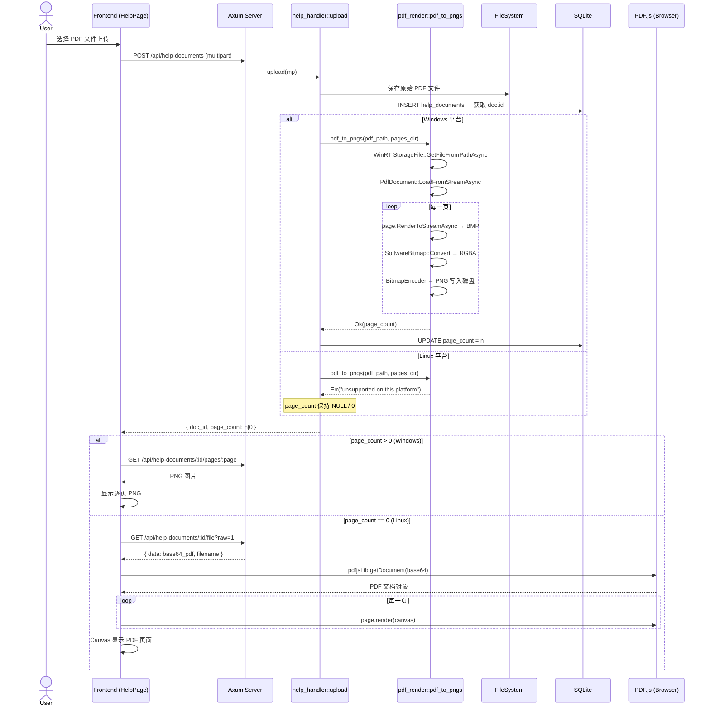
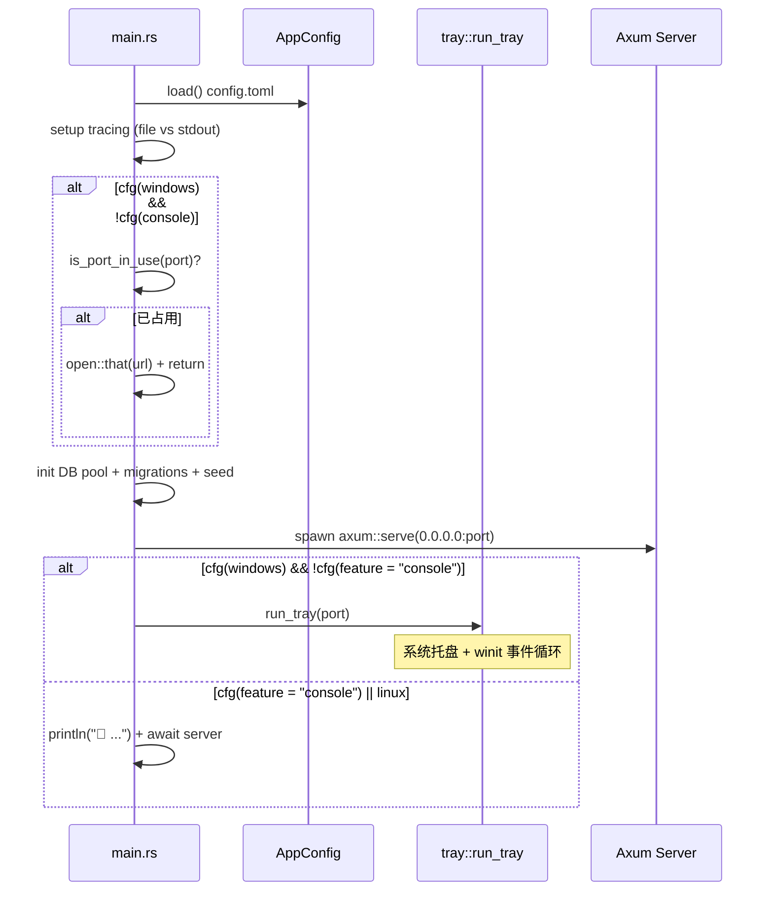
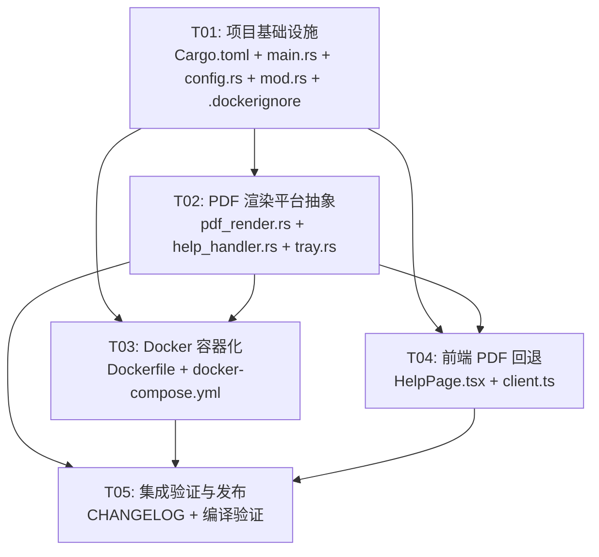

# v0.4.21 跨平台改造 — 系统架构设计

> **Architect**: Bob | **日期**: 2025-07-08 | **基准版本**: v0.4.20

---

## Part A: 系统设计

### 1. 实现方案

#### 1.1 核心技术挑战

| 挑战 | 现状 | 方案 |
|------|------|------|
| `windows` crate 无条件依赖 | Cargo.toml `[dependencies]` 中 | 移入 `[target.'cfg(windows)'.dependencies]` |
| `winresource` 无条件构建依赖 | Cargo.toml `[build-dependencies]` 中 | 移入 `[target.'cfg(windows)'.build-dependencies]` |
| `windows_subsystem = "windows"` | main.rs 无条件使用 | 改为 `all(target_os = "windows", not(feature = "console"))` |
| `pdf_render.rs` 全量 WinRT API | 97 行全部 Windows.Data.Pdf | `#[cfg(windows)]` 保留原实现 + `#[cfg(not(windows))]` 返回错误 |
| `tray` 模块 | tray-icon/winit 有 Linux 支持但项目不需要 | 条件编译：Linux 下不包含 tray 模块 |
| 前端 PDF 预览 | 依赖服务端 PNG | Linux 下回退到 PDF.js 浏览器端渲染 |

#### 1.2 技术选型

| 层面 | 选型 | 理由 |
|------|------|------|
| 条件编译策略 | Rust `#[cfg(target_os = "windows")]` + `target.` 依赖 | 零运行时开销，编译期决定 |
| PDF Linux 回退 | Stub 函数返回 `Err("unsupported")` | 最小改动，前端已有降级逻辑 |
| 前端 PDF 渲染 | 已有 PDF.js (v0.4.15 集成) | 无需新增依赖，增强已有回退路径 |
| Docker 基础镜像 | `rust:1.80-slim-bookworm` (builder) + `debian:bookworm-slim` (runtime) | 小体积、多阶段构建 |
| 数据目录 | `/app/data` | 符合 Docker 惯例，通过 volume 持久化 |
| 健康检查 | `GET /api/health` → `{"status":"ok"}` | Docker HEALTHCHECK + 运维监控 |

#### 1.3 架构模式

架构不变：**单体 Axum 服务 + 嵌入式前端**。改动集中在条件编译边界，无需引入新架构模式。

---

### 2. 文件列表

```
v0.4.21/
├── Cargo.toml                    # [修改] 平台条件依赖
├── build.rs                      # [不改] 已有 OS 检测，但需确认
├── src/
│   ├── main.rs                   # [修改] cfg 条件化
│   ├── lib.rs                    # [不改] 无变化
│   ├── config.rs                 # [修改] 增加 Docker 数据目录识别
│   ├── error.rs                  # [不改]
│   ├── tray.rs                   # [修改] 提取 is_port_in_use
│   ├── api/
│   │   ├── mod.rs                # [修改] 加 /api/health endpoint
│   │   ├── pdf_render.rs         # [修改] 平台条件编译
│   │   ├── help_handler.rs       # [修改] 条件调用 pdf_to_pngs
│   │   └── ... (其余不变)
│   ├── db/ ...                   # [不改]
│   ├── models/ ...               # [不改]
│   ├── repo/ ...                 # [不改]
│   ├── service/ ...              # [不改]
│   └── utils/ ...                # [不改]
├── frontend/
│   └── src/
│       ├── pages/HelpPage.tsx    # [修改] PDF.js 浏览器端回退
│       └── api/client.ts         # [修改] 新增 health check API
├── static/                       # [不改] 前端构建产物
├── Dockerfile                    # [新增] 多阶段构建
├── docker-compose.yml            # [新增] Docker Compose 编排
└── .dockerignore                 # [新增] Docker 构建忽略
```

**改动汇总**：修改 7 个文件 + 新增 3 个文件 = 共 10 个文件

---

### 3. 数据结构和接口

#### 3.1 类图

```mermaid
classDiagram
    class AppConfig {
        +u16 server_port
        +String db_dir
        +String log_level
        +Option~String~ log_file
        +String admin_user
        +String admin_pass
        +bool backup_enabled
        +u64 backup_interval_hours
        +u64 max_backup_count
        +load() AppConfig
        +save()
        +db_path() PathBuf
        +backup_dir() PathBuf
        +data_dir() PathBuf
    }

    class HealthResponse {
        +String status
        +String version
    }

    class pdf_render~Windows~ {
        <<module>>
        +pdf_to_pngs(Path, Path) Result~u32, String~
    }

    class pdf_render~Linux~ {
        <<module>>
        +pdf_to_pngs(Path, Path) Result~u32, String~
    }

    class HelpHandler {
        +router(DbPool) Router
        -upload(State, Multipart) Result
        -get_page(State, Path) Result
    }

    class TrayModule~Windows~ {
        +run_tray(u16)
        +is_port_in_use(u16) bool
    }

    class PortCheck~CrossPlatform~ {
        +is_port_in_use(u16) bool
    }

    HelpHandler ..|> pdf_render~Windows~ : "cfg(windows)"
    HelpHandler ..|> pdf_render~Linux~ : "cfg(not(windows))"
    
    note for pdf_render~Linux~ "返回 Err(\"unsupported on this platform\")"
    note for TrayModule~Windows~ "仅 Windows 编译"
    note for PortCheck~CrossPlatform~ "从 tray.rs 提取，跨平台"
```

#### 3.2 新增 API 端点

**GET /api/health** (P2)

```
Response 200:
{
    "code": 0,
    "data": {
        "status": "ok",
        "version": "0.4.21"
    },
    "message": "ok"
}
```

---

### 4. 程序调用流程

#### 4.1 PDF 上传流程（Windows vs Linux 分支）



#### 4.2 服务启动流程（跨平台差异）



---

### 5. 待明确事项

| # | 事项 | 假设 |
|---|------|------|
| A1 | Linux 是否保留 tray-icon/winit 依赖但仅不编译 tray.rs？ | **是**。tray-icon/winit 本身跨平台，保留在 Cargo.toml 通用依赖中，仅 tray.rs 用 `#[cfg(windows)]` 条件编译。如需极致减依赖可后续优化。 |
| A2 | Docker 中 config.toml 的加载方式？ | exe 在 `/app/`，config.toml 放在 `/app/config.toml`，与 Windows 行为一致。 |
| A3 | PDF.js 是否需要下载为独立文件还是从 node_modules 引用？ | 项目已集成 PDF.js，在 HelpPage.tsx 中通过 CDN 或 bundle 使用。本次增强回退逻辑仅需修改组件逻辑，无需新增 npm 包。 |
| A4 | Docker 端口映射？ | 默认 8000:8000，可通过环境变量 `SERVER_PORT` 覆盖。 |

---

## Part B: 任务分解

### 6. 依赖包变化

#### Cargo.toml diff 要点

```toml
# === 移除（从 [dependencies] 移动到 target-specific） ===
# windows = { version = "0.58", features = [...] }  ← 删除

# === 移除（从 [build-dependencies] 移动到 target-specific） ===
# winresource = "0.1"  ← 删除

# === 新增 ===
[target.'cfg(windows)'.dependencies]
windows = { version = "0.58", features = [
    "Data_Pdf", "Foundation", "Graphics_Imaging",
    "Storage_Streams", "Storage"
] }

[target.'cfg(windows)'.build-dependencies]
winresource = "0.1"

# === 版本号 ===
version = "0.4.21"
```

**无新增第三方 crate**。仅重组现有依赖的平台归属。

---

### 7. 任务列表

#### T01: 项目基础设施与跨平台编译配置

| 属性 | 值 |
|------|-----|
| **Task ID** | T01 |
| **优先级** | P0 |
| **依赖** | 无 |

**涉及文件**:
- `Cargo.toml` — 平台条件依赖重组 + 版本 bump 到 0.4.21
- `build.rs` — 验证（当前 build.rs 已做 `CARGO_CFG_TARGET_OS` 检测，无需改动，但需确认 Linux 下不编译 winresource）
- `src/main.rs` — `windows_subsystem` 改为 `all(target_os = "windows", not(feature = "console"))`；`mod tray` 改为 `#[cfg(windows)] mod tray`；tray 相关调用加 `#[cfg(windows)]` 守卫；提取 `is_port_in_use` 为独立函数
- `src/config.rs` — 新增 `data_dir()` 方法，Docker 下优先使用 `WORKLOAD_DATA_DIR` 环境变量
- `src/api/mod.rs` — 新增 `GET /api/health` 端点；pdf_render 模块声明改为条件声明
- `.dockerignore` — 新增：排除 target/、node_modules/、dist/ 等构建无关文件

**关键设计点**:

```rust
// main.rs — 条件编译示意

// 仅 Windows 非 console 模式使用 windows 子系统
#![cfg_attr(
    all(target_os = "windows", not(feature = "console")),
    windows_subsystem = "windows"
)]

// tray 模块仅 Windows 编译
#[cfg(target_os = "windows")]
mod tray;

// is_port_in_use 从 tray.rs 提取到 main.rs 或独立函数
fn is_port_in_use(port: u16) -> bool {
    std::net::TcpListener::bind(("127.0.0.1", port)).is_err()
}
```

```rust
// config.rs — Docker 数据目录
impl AppConfig {
    /// 数据根目录：Docker 优先用环境变量，否则跟随 exe
    pub fn data_dir() -> PathBuf {
        std::env::var("WORKLOAD_DATA_DIR")
            .map(PathBuf::from)
            .unwrap_or_else(|_| {
                std::env::current_exe()
                    .ok()
                    .and_then(|p| p.parent().map(|p| p.to_path_buf()))
                    .unwrap_or_else(|| PathBuf::from("."))
            })
    }
}
```

#### T02: PDF 渲染平台抽象 + 帮助处理器适配

| 属性 | 值 |
|------|-----|
| **Task ID** | T02 |
| **优先级** | P0 |
| **依赖** | T01 |

**涉及文件**:
- `src/api/pdf_render.rs` — 双平台实现：`#[cfg(windows)]` 保留 WinRT 代码（97行不变），`#[cfg(not(windows))]` 新增 stub 返回 `Err("PDF rendering is not supported on this platform")`
- `src/api/help_handler.rs` — 在 `upload()` 函数中 PDF 转换调用处加 `#[cfg(windows)]` 守卫；`get_page()` 端点加平台感知的错误消息
- `src/tray.rs` — 确认 tray.rs 仅 Windows 编译（无需额外改动，T01 已在 main.rs 中条件化 `mod tray`）

**关键设计点**:

```rust
// pdf_render.rs — 平台双实现

#[cfg(windows)]
mod imp {
    use std::path::Path;
    use windows::core::HSTRING;
    use windows::Data::Pdf::PdfDocument;
    // ... 现有 97 行 WinRT 实现保持不变
    pub fn pdf_to_pngs(pdf_path: &Path, out_dir: &Path) -> Result<u32, String> {
        // 现有实现
    }
}

#[cfg(not(windows))]
mod imp {
    use std::path::Path;
    pub fn pdf_to_pngs(_pdf_path: &Path, _out_dir: &Path) -> Result<u32, String> {
        Err("PDF rendering is not supported on this platform (requires Windows)".to_string())
    }
}

pub use imp::pdf_to_pngs;
```

#### T03: Docker 容器化

| 属性 | 值 |
|------|-----|
| **Task ID** | T03 |
| **优先级** | P0 (Dockerfile) / P2 (docker-compose) |
| **依赖** | T01, T02 |

**涉及文件**:
- `Dockerfile` (新增) — 多阶段构建：stage1 `rust:1.80-slim-bookworm` 编译（带 `--features console`），stage2 `debian:bookworm-slim` 运行
- `docker-compose.yml` (新增) — 服务定义、volume 挂载 `/app/data`、端口 8000、环境变量
- `.dockerignore` — T01 中已创建，本任务验证覆盖

**Dockerfile 设计要点**:

```dockerfile
# Stage 1: Build
FROM rust:1.80-slim-bookworm AS builder
RUN apt-get update && apt-get install -y pkg-config libssl-dev && rm -rf /var/lib/apt/lists/*
WORKDIR /app
COPY Cargo.toml Cargo.lock ./
COPY src/ ./src/
COPY build.rs ./
RUN mkdir -p static && echo '<html></html>' > static/index.html
# 预构建依赖层（缓存优化）
RUN cargo build --release --features console && rm -rf target/release/deps/workload_tool*
# 实际构建
COPY static/ ./static/
RUN cargo build --release --features console

# Stage 2: Runtime
FROM debian:bookworm-slim
RUN apt-get update && apt-get install -y ca-certificates libssl3 && rm -rf /var/lib/apt/lists/*
WORKDIR /app
COPY --from=builder /app/target/release/workload-tool .
COPY --from=builder /app/static/ ./static/
RUN mkdir -p /app/data
ENV WORKLOAD_DATA_DIR=/app/data
EXPOSE 8000
HEALTHCHECK --interval=30s --timeout=3s --retries=3 \
    CMD curl -f http://localhost:8000/api/health || exit 1
CMD ["./workload-tool"]
```

#### T04: 前端 PDF 回退增强

| 属性 | 值 |
|------|-----|
| **Task ID** | T04 |
| **优先级** | P1 |
| **依赖** | T02 |

**涉及文件**:
- `frontend/src/pages/HelpPage.tsx` — 当 `page_count == 0` 时切换为 PDF.js 浏览器端渲染（而非仅显示"不支持预览"）；从 `/api/help-documents/:id/file?raw=1` 获取 base64 PDF 数据
- `frontend/src/api/client.ts` — 新增 `checkHealth()` API 调用（用于前端判断服务端能力）；新增 `getHelpDocumentFileRaw()` 辅助函数
- `frontend/package.json` — 确认 `pdfjs-dist` 依赖已存在（v0.4.15 已集成），无需新增

**关键设计点**:

```tsx
// HelpPage.tsx — PDF 回退逻辑
// 当 page_count == 0 且 file_type == "pdf" 时：
// 1. 调用 getHelpDocumentFileRaw(id) 获取 base64
// 2. 使用 pdfjsLib.getDocument({ data: atob(base64) }) 加载
// 3. Canvas 逐页渲染 + 翻页控件
// 
// 现有 PNG 预览路径（page_count > 0）保持不变
```

#### T05: 集成验证与发布

| 属性 | 值 |
|------|-----|
| **Task ID** | T05 |
| **优先级** | P0 (回归) / P2 (文档) |
| **依赖** | T01, T02, T03, T04 |

**涉及文件**:
- `Cargo.toml` — 确认版本号 0.4.21（T01 已设）
- `CHANGELOG_v0.4.21.md` (新增) — 版本变更说明
- 编译验证 — Linux x86_64 编译通过（`cargo build --release --features console --target x86_64-unknown-linux-gnu`）
- 回归验证 — Windows `cargo build --release` 零退化
- Docker 构建验证 — `docker build -t workload-tool:0.4.21 .`

---

### 8. 共享知识

#### 条件编译宏命名规范

```
平台检测:    target_os = "windows"     (Rust 内置，不使用自定义 feature)
功能检测:    feature = "console"       (项目自定义 feature)
组合条件:    all(target_os = "windows", not(feature = "console"))
```

#### 文件路径约定

```
Windows exe:   C:\Program Files\WorkloadTool\workload-tool.exe
Windows data:  exe_dir/data/
Linux data:    $WORKLOAD_DATA_DIR (Docker: /app/data, 裸机: exe_dir/data)
Config:        exe_dir/config.toml
```

#### 错误处理约定

```
- 所有 API 响应使用统一 ApiResponse { code, data, message } 格式
- pdf_to_pngs() 在非 Windows 返回 Err(String) 而非 panic
- 前端根据 page_count 是否为 0 选择渲染策略
```

#### Docker 约定

```
- 基础镜像: debian:bookworm-slim
- 数据卷: /app/data (持久化 SQLite + help_docs)
- 端口: 8000 (可覆盖)
- 健康检查: GET /api/health
- 构建: --features console（始终启用）
```

---

### 9. 任务依赖图



---

## 附录：风险评估

| 风险 | 可能性 | 影响 | 缓解措施 |
|------|--------|------|----------|
| `tray-icon`/`winit` 在 Linux 编译失败 | 低 | 中 | 保留在通用依赖中但不使用；如失败则移入 `cfg(windows)` |
| `calamine` 等解析库在 Linux 行为差异 | 低 | 低 | 纯 Rust crate，跨平台一致 |
| Docker 中 SQLite `bundled` 编译问题 | 中 | 高 | 在 builder 阶段安装 `libsqlite3-dev` |
| 前端 PDF.js bundle 体积过大 | 低 | 低 | pdfjs-dist 已集成，仅加载逻辑变化 |
