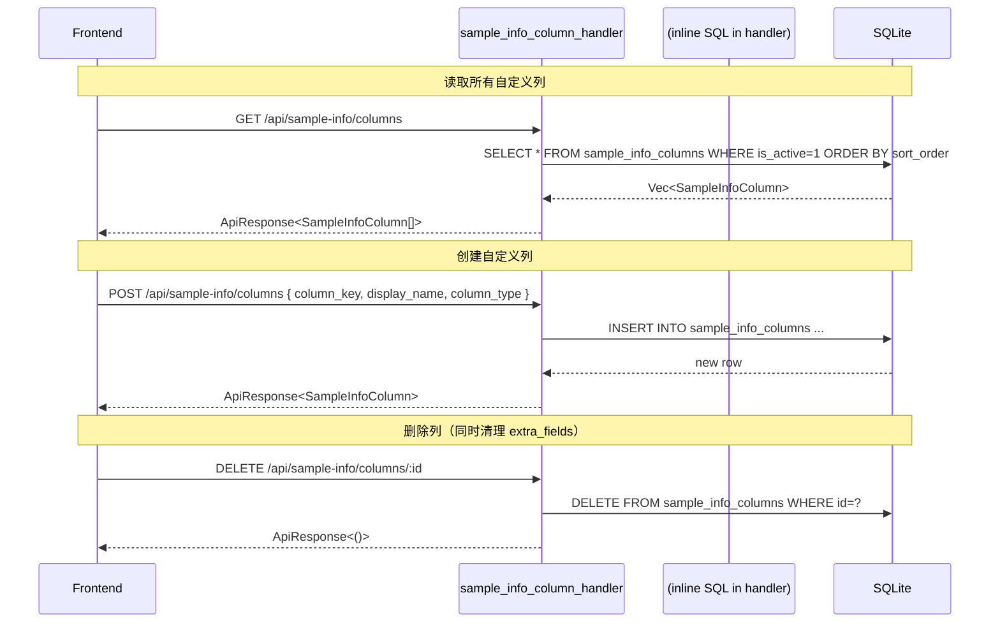
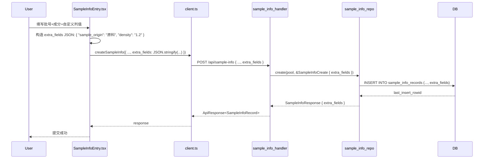
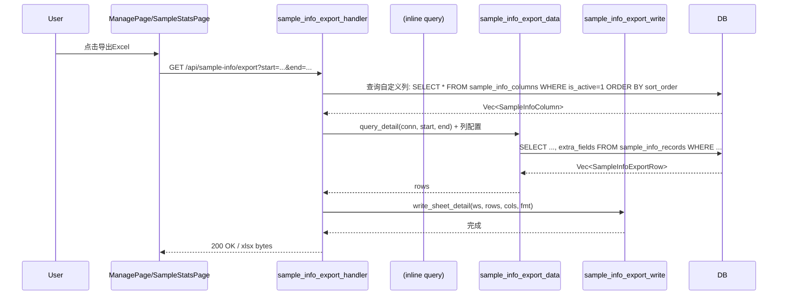
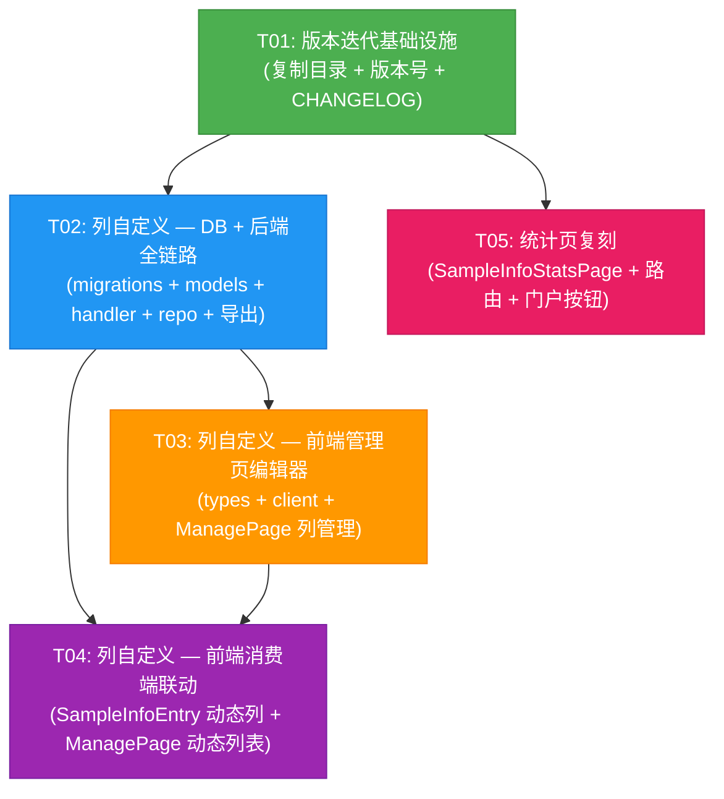

# v0.4.26 系统设计与任务分解

> 架构师：高见远
> 日期：基于 v0.4.25 代码分析生成

---

## Part A：系统设计

### 1. 实现方案分析

#### 难点分析

| 难点 | 说明 |
|------|------|
| **列自定义全链路同步** | 需要后端 DB schema 变更（ALTER TABLE + 新表）、动态 SQL 生成、前端动态表单字段、动态列表渲染、导出 Excel 动态列头 — 五个环节保持一致 |
| **统计页复刻质量** | StatsPage.tsx 有 13 个选项卡/1300+ 行代码，需要完整理解其"卡片网格→点击展开→筛选联动"的模式，再适配样品信息登记的数据结构 |
| **版本隔离** | 复制整个目录结构，确保 Cargo.toml、package.json、CHANGELOG 版本同步，且构建脚本指向新目录 |

#### 技术选型与理由

| 层次 | 选型 | 理由 |
|------|------|------|
| 后端 Web 框架 | Axum 0.7（已有） | 项目已成熟使用 |
| 数据库 | SQLite + r2d2 连接池（已有） | 嵌入式部署无需外部依赖 |
| 动态列存储 | `sample_info_records.extra_fields` TEXT JSON 列 | 无需为每个自定义列建独立列，JSON 天然可扩展 |
| 列元数据表 | `sample_info_columns` 独立表 | 字段名/类型/排序/启用状态持久化管理 |
| 前端框架 | React 18 + MUI 5（已有） | 项目已使用 |
| 前端状态 | React useState + useEffect（已有） | 无需引入 Redux 等，当前模式够用 |
| 导出 Excel | rust_xlsxwriter（已有） | 已有封装 Fmt 样式系统 |

#### 架构模式

- **后端**: 分层架构（Handler → Service/Repo → DB）
- **前端**: 组件化 + 页面级状态管理
- **列自定义**: 元数据驱动模式 — `sample_info_columns` 表驱动所有消费端的列渲染和查询

---

### 2. 文件清单

所有路径基于 `v0.4.26/` 目录。

#### 版本隔离 — 新建（复制）

| # | 文件路径 | 操作 | 说明 |
|---|----------|------|------|
| F01 | `v0.4.26/` | 新建 | 复制 `v0.4.25/` 整个目录 |
| F02 | `Cargo.toml` | 修改 | version = "0.4.26" |
| F03 | `frontend/package.json` | 修改 | version = "0.4.26" |
| F04 | `CHANGELOG_v0.4.26.md` | 新建 | 本次变更记录 |
| F05 | `build_installer.iss` | 修改 | OutputBaseFilename 含 0.4.26 |

#### 需求 2：列自定义（后端 10 文件）

| # | 文件路径 | 操作 | 说明 |
|---|----------|------|------|
| F06 | `src/db/migrations.rs` | 修改 | 新建 `sample_info_columns` 表；ALTER TABLE `sample_info_records` ADD COLUMN `extra_fields` TEXT |
| F07 | `src/models/sample_info.rs` | 修改 | 新增 `SampleInfoColumn`、`SampleInfoColumnCreate`、`SampleInfoColumnUpdate`；`SampleInfoRecord` 增加 `extra_fields: Option<String>`；`SampleInfoResponse` 增加 `extra_fields`；`SampleInfoCreate/Update` 增加 `extra_fields` |
| F08 | `src/models/mod.rs` | 修改 | pub mod 新模型（或直接放在 sample_info.rs） |
| F09 | `src/models/sample_info_column.rs` | **新建** | 列自定义的独立模型文件（可选，也可放 sample_info.rs） |
| F10 | `src/api/mod.rs` | 修改 | pub mod sample_info_column_handler; 注册路由 |
| F11 | `src/api/sample_info_column_handler.rs` | **新建** | 列自定义 CRUD API handler |
| F12 | `src/repo/sample_info_repo.rs` | 修改 | list/create/update 增加 extra_fields 字段的读写；get_by_id_on_conn 增加 extra_fields |
| F13 | `src/api/sample_info_handler.rs` | 修改 | stats 不涉及列自定义，但 list/create/update handler 透传 extra_fields |
| F14 | `src/api/sample_info_export_data.rs` | 修改 | `SampleInfoExportRow` 增加 `extra_fields: Option<String>`；`query_detail` 查询 extra_fields；按自定义列动态生成列 |
| F15 | `src/api/sample_info_export_write.rs` | 修改 | `write_sheet_detail` 动态列头+动态数据写入 |

#### 需求 2：列自定义（前端 4 文件）

| # | 文件路径 | 操作 | 说明 |
|---|----------|------|------|
| F16 | `frontend/src/types/index.ts` | 修改 | 新增 `SampleInfoColumn` 接口；`SampleInfoRecord` 增加 `extra_fields?: Record<string, string>` |
| F17 | `frontend/src/api/client.ts` | 修改 | 新增 `getSampleInfoColumns` / `createSampleInfoColumn` / `updateSampleInfoColumn` / `deleteSampleInfoColumn` / `reorderSampleInfoColumns` |
| F18 | `frontend/src/pages/ManagePage.tsx` | 修改 | 新增「④ 自定义列管理」区域：拖拽排序、CRUD 表单 |
| F19 | `frontend/src/pages/SampleInfoEntry.tsx` | 修改 | 录入表单动态渲染自定义列；记录列表详情展开也显示自定义列 |

#### 需求 1：统计页复刻（前端 3 文件）

| # | 文件路径 | 操作 | 说明 |
|---|----------|------|------|
| F20 | `frontend/src/pages/SampleInfoStatsPage.tsx` | **新建** | 完整复刻 StatsPage 模式，8 个绿色卡片：按状态/检测类型/实验室/项目/送样人/月/送样人记录/导出 |
| F21 | `frontend/src/pages/SampleInfoHome.tsx` | 修改 | 底部新增「查看统计」按钮，navigate 到 `/sample-info/stats` |
| F22 | `frontend/src/App.tsx` | 修改 | 新增路由 `<Route path="/sample-info/stats" element={<SampleInfoStatsPage />} />` |

#### 文件变更汇总

| 操作 | 数量 | 文件 |
|------|------|------|
| 新建目录 | 1 | v0.4.26/（复制） |
| 新建文件 | 4 | CHANGELOG, sample_info_column_handler.rs, sample_info_column.rs(可选), SampleInfoStatsPage.tsx |
| 修改文件 | 16 | Cargo.toml, package.json, migrations.rs, models/sample_info.rs, models/mod.rs, api/mod.rs, repo/sample_info_repo.rs, api/sample_info_handler.rs, api/sample_info_export_data.rs, api/sample_info_export_write.rs, types/index.ts, client.ts, ManagePage.tsx, SampleInfoEntry.tsx, SampleInfoHome.tsx, App.tsx |
| **总计** | **~22 文件** | |

---

### 3. 数据结构和接口

#### 3.1 后端 Rust 数据结构

```mermaid
classDiagram
    class SampleInfoColumn {
        +i64 id
        +String column_key
        +String display_name
        +String column_type  // "text" | "number" | "date"
        +i64 sort_order
        +bool is_active
        +String created_at
        +String updated_at
    }

    class SampleInfoColumnCreate {
        +String column_key
        +String display_name
        +String column_type
        +i64 sort_order
    }

    class SampleInfoColumnUpdate {
        +Option~String~ display_name
        +Option~String~ column_type
        +Option~i64~ sort_order
        +Option~bool~ is_active
    }

    class SampleInfoRecord_v0426 {
        +i64 id
        +String status
        +i64 seq_no
        +String batch_no
        +String user_name
        +String lab_name
        +String project_name
        +String submitted_at
        +String detection_date
        +String main_components
        +String detection_type
        +String type_key
        +Option~i64~ division_id
        +i64 quantity
        +String notes
        +Option~String~ extra_fields  // NEW: JSON {"col_key": "value"}
        +String created_at
        +Option~String~ updated_at
        +Option~String~ deleted_at
    }

    class SampleInfoResponse_v0426 {
        +i64 id
        +String status
        +...  // 同现有
        +Option~String~ extra_fields  // NEW
    }

    class SampleInfoCreate_v0426 {
        +...  // 同现有
        +Option~String~ extra_fields  // NEW
    }

    class SampleInfoUpdate_v0426 {
        +...  // 同现有
        +Option~String~ extra_fields  // NEW
    }

    SampleInfoColumnCreate --|> SampleInfoColumn : creates
    SampleInfoColumnUpdate --|> SampleInfoColumn : updates
```

#### 3.2 前端 TypeScript 接口

```typescript
// 新增 — 自定义列定义
export interface SampleInfoColumn {
  id: number;
  column_key: string;       // 唯一标识（英文，如 "sample_origin"）
  display_name: string;     // 显示名称（如 "样品来源"）
  column_type: string;      // "text" | "number" | "date"
  sort_order: number;
  is_active: boolean;
  created_at: string;
  updated_at?: string;
}

// 扩展现有 — SampleInfoRecord 增加 extra_fields
export interface SampleInfoRecord {
  // ... 现有字段不变 ...
  extra_fields?: Record<string, string>;  // NEW
}

// 新增 — 排序请求
export interface SampleInfoColumnReorder {
  ids: number[];  // 按新顺序排列的 ID 数组
}
```

#### 3.3 API 端点

| 方法 | 路径 | 说明 | 请求体 | 响应 |
|------|------|------|--------|------|
| GET | `/api/sample-info/columns` | 获取所有自定义列 | — | `ApiResponse<SampleInfoColumn[]>` |
| POST | `/api/sample-info/columns` | 创建自定义列 | `SampleInfoColumnCreate` | `ApiResponse<SampleInfoColumn>` |
| PUT | `/api/sample-info/columns/:id` | 更新自定义列 | `SampleInfoColumnUpdate` | `ApiResponse<SampleInfoColumn>` |
| DELETE | `/api/sample-info/columns/:id` | 删除自定义列 | — | `ApiResponse<()>` |
| PUT | `/api/sample-info/columns/reorder` | 排序自定义列 | `{ids: number[]}` | `ApiResponse<()>` |
| GET | `/api/sample-info/stats` | 统计（已有） | `?start=&end=&type_key=&status=` | `ApiResponse<SampleInfoStats>` |

> **注意**：list/create/update/delete 端点不变，但 create/update 请求体中增加可选的 `extra_fields` 字段，list 响应中增加 `extra_fields`。

#### 3.4 DB 迁移（SQLite）

```sql
-- 新建：自定义列配置表
CREATE TABLE IF NOT EXISTS sample_info_columns (
    id          INTEGER PRIMARY KEY AUTOINCREMENT,
    column_key  TEXT NOT NULL UNIQUE,
    display_name TEXT NOT NULL,
    column_type TEXT NOT NULL DEFAULT 'text',
    sort_order  INTEGER NOT NULL DEFAULT 0,
    is_active   INTEGER NOT NULL DEFAULT 1,
    created_at  TEXT NOT NULL DEFAULT (datetime('now','localtime')),
    updated_at  TEXT DEFAULT (datetime('now','localtime'))
);

-- 新建索引
CREATE INDEX IF NOT EXISTS idx_sic_sort ON sample_info_columns(sort_order);

-- 填充默认列（可选：根据当前业务字段预设）
INSERT OR IGNORE INTO sample_info_columns (column_key, display_name, column_type, sort_order) VALUES
    ('batch_no', '样品批号', 'text', 1),
    ('user_name', '送样人', 'text', 2),
    ('lab_name', '实验室/车间', 'text', 3),
    ('project_name', '所属项目', 'text', 4),
    ('main_components', '样品主要成分', 'text', 5),
    ('detection_type', '检测类型', 'text', 6),
    ('quantity', '送样数量', 'number', 7),
    ('notes', '注意事项', 'text', 8);

-- ALTER TABLE：增加 extra_fields JSON 列
ALTER TABLE sample_info_records ADD COLUMN extra_fields TEXT DEFAULT '{}';
```

---

### 4. 程序调用流程

#### 4.1 列自定义 CRUD 流程（后端）



#### 4.2 录入表单提交带自定义列



#### 4.3 导出 Excel 带自定义列



---

### 5. 待明确事项

| 事项 | 说明 | 建议 |
|------|------|------|
| **自定义列删除时的数据清理** | 删除列定义后，已有记录的 extra_fields 中对应 key 的旧数据是否清理 | 本次不做数据清理（保留但前端不渲染），后续可加批量清理 |
| **列类型验证** | 前端提交 extra_fields 的值是否需要按 column_type 做类型校验 | 建议前端 text 字段用 `<TextField>`，number 用 `<TextField type="number">`，date 用 `<TextField type="date">` |
| **统计页 8 个卡片的"送样人记录"** | 需要单独的电话查询接口还是一个带分页的列表 | 复用现有 list 接口 + 筛选送样人即可 |
| **统计页"导出Excel"** | 复用现有的 `/api/sample-info/export` | 复用即可，统计页只是入口不同 |
| **默认列的种子数据** | 是否将现有的内置列（批号/送样人等）在 sample_info_columns 中同步一份 | 建议插入种子数据，这样新用户初始就有一份可编辑的列配置 |
| **列排序** | 前端用拖拽排序还是上下箭头 | 建议用上下箭头按钮（更简单），后续可升级拖拽 |

---

## Part B：任务分解

### 6. 依赖包

**无需新增包**。所有功能基于现有依赖：
- 后端：`serde` / `serde_json` / `rusqlite` / `rust_xlsxwriter`（均已存在）
- 前端：`react` / `@mui/material` / `@mui/icons-material` / `axios` / `dayjs`（均已存在）
- 前端新增可能的包：`@dnd-kit/core` + `@dnd-kit/sortable`（已存在！在 package.json 中）

---

### 7. 任务列表

> **分组策略**：按模块分批，每批可独立编译检查。

#### T01：版本迭代基础设施

| 字段 | 值 |
|------|-----|
| **Task ID** | T01 |
| **任务名称** | 复制 v0.4.25 → v0.4.26，更新版本号与 CHANGELOG |
| **源文件** | 整个 v0.4.26/ 目录 |
| **依赖** | 无 |
| **优先级** | P0 |

**具体操作**：
1. 复制 `v0.4.25/` 整个目录为 `v0.4.26/`
2. 修改 `v0.4.26/Cargo.toml`：`version = "0.4.26"`
3. 修改 `v0.4.26/frontend/package.json`：`"version": "0.4.26"`
4. 新建 `v0.4.26/CHANGELOG_v0.4.26.md`，记录本次三个需求
5. 修改 `v0.4.26/build_installer.iss`：OutputBaseFilename 包含 `v0.4.26`，AppVersion 改为 `0.4.26`

**编译检查**：
```bash
cd v0.4.26 && cargo build --release && cd frontend && npm run build
```

---

#### T02：列自定义 — DB 迁移 + 后端全链路

| 字段 | 值 |
|------|-----|
| **Task ID** | T02 |
| **任务名称** | 列自定义：DB 迁移、模型、API handler、repo 扩展、导出同步 |
| **源文件** | `src/db/migrations.rs`, `src/models/sample_info.rs`, `src/api/sample_info_column_handler.rs` (新建), `src/api/mod.rs`, `src/repo/sample_info_repo.rs`, `src/api/sample_info_handler.rs`, `src/api/sample_info_export_data.rs`, `src/api/sample_info_export_write.rs` |
| **依赖** | T01 |
| **优先级** | P0 |

**具体操作**：

1. **`src/db/migrations.rs`** — 追加 v0.4.26 迁移代码：
   - `CREATE TABLE IF NOT EXISTS sample_info_columns (...)` 含 id, column_key UNIQUE, display_name, column_type, sort_order, is_active, created_at, updated_at
   - `CREATE INDEX IF NOT EXISTS idx_sic_sort ON sample_info_columns(sort_order)`
   - 插入种子数据：8 个内置列的默认配置
   - `ALTER TABLE sample_info_records ADD COLUMN extra_fields TEXT DEFAULT '{}'`

2. **`src/models/sample_info.rs`** — 数据结构扩展：
   - `SampleInfoRecord`: 增加 `pub extra_fields: Option<String>`（第 1 个新字段，放在 notes 和 created_at 之间）
   - `SampleInfoResponse`: 增加 `pub extra_fields: Option<String>`，update From 实现
   - `SampleInfoCreate`: 增加 `pub extra_fields: Option<String>`
   - `SampleInfoUpdate`: 增加 `pub extra_fields: Option<String>`
   - 新增 `SampleInfoColumn` struct（全字段）
   - 新增 `SampleInfoColumnCreate` struct（column_key, display_name, column_type, sort_order）
   - 新增 `SampleInfoColumnUpdate` struct（全 Option）

3. **`src/api/sample_info_column_handler.rs`** — 新建，含 5 个端点：
   - `GET /api/sample-info/columns` → list_columns
   - `POST /api/sample-info/columns` → create_column
   - `PUT /api/sample-info/columns/:id` → update_column
   - `DELETE /api/sample-info/columns/:id` → delete_column
   - `PUT /api/sample-info/columns/reorder` → reorder_columns
   - 所有操作直接在 handler 内执行 SQL（不建独立 repo，简化结构）
   - 注册 router 函数 `pub fn router()`

4. **`src/api/mod.rs`** — 新增 `pub mod sample_info_column_handler;` 并在 `api_router()` 中 `.merge(sample_info_column_handler::router(pool.clone()))`

5. **`src/repo/sample_info_repo.rs`** — 所有 SQL 查询增加 extra_fields 字段：
   - `list` 的 SELECT 中增加 `extra_fields`（第 15 个字段，索引 14→15 后移）
   - `get_by_id_on_conn` 的 SELECT 中增加 extra_fields
   - `create` 的 INSERT 中增加 extra_fields 占位符和参数
   - `update` 中增加 extra_fields 的更新逻辑

6. **`src/api/sample_info_handler.rs`** — handler 层透传 extra_fields：
   - 无需大改，SampleInfoCreate/Update 已自带 extra_fields，直接透传

7. **`src/api/sample_info_export_data.rs`** — 导出数据层：
   - `SampleInfoExportRow` 增加 `pub extra_fields: Option<String>`
   - `query_detail` 的 SELECT 中增加 `sir.extra_fields`
   - 新增 `query_active_columns()` 函数查询有效列定义

8. **`src/api/sample_info_export_write.rs`** — 导出写入层：
   - `write_sheet_detail` 增加 `columns: &[SampleInfoColumn]` 参数
   - 动态生成列头（先写固定列，再追加自定义列）
   - 动态写入数据（从 extra_fields JSON 中提取值）
   - 其他汇总 Sheet（按状态/类型/实验室等）不变

**编译检查**：
```bash
cd v0.4.26 && cargo build
```

---

#### T03：列自定义 — 前端管理页编辑器

| 字段 | 值 |
|------|-----|
| **Task ID** | T03 |
| **任务名称** | 列自定义：类型定义、API client、ManagePage 列编辑器 |
| **源文件** | `frontend/src/types/index.ts`, `frontend/src/api/client.ts`, `frontend/src/pages/ManagePage.tsx` |
| **依赖** | T02 |
| **优先级** | P0 |

**具体操作**：

1. **`frontend/src/types/index.ts`**：
   - 新增 `SampleInfoColumn` 接口（对应后端字段）
   - 新增 `SampleInfoColumnCreate` / `SampleInfoColumnUpdate` 接口
   - `SampleInfoRecord` 增加 `extra_fields?: Record<string, string>`

2. **`frontend/src/api/client.ts`**：
   - 新增 `getSampleInfoColumns()` → `GET /api/sample-info/columns`
   - 新增 `createSampleInfoColumn(data)` → `POST /api/sample-info/columns`
   - 新增 `updateSampleInfoColumn(id, data)` → `PUT /api/sample-info/columns/:id`
   - 新增 `deleteSampleInfoColumn(id)` → `DELETE /api/sample-info/columns/:id`
   - 新增 `reorderSampleInfoColumns(ids)` → `PUT /api/sample-info/columns/reorder`

3. **`frontend/src/pages/ManagePage.tsx`** — 新增「④ 自定义列管理」区域：
   - 在 sampleinfo 标签页内，检测类型下方、记录查询上方插入
   - 标题：`④ 自定义列配置`
   - 表格列：显示名称 / 字段标识 / 类型 / 排序 / 启用状态 / 操作
   - 顶部有「新建列」按钮
   - 新建/编辑表单：字段标识(column_key) / 显示名称 / 类型(下拉选择 text/number/date) / 排序 / 启用开关
   - 每行有上移/下移排序按钮（替代拖拽，实现简单）
   - 删除按钮 + ConfirmDialog 确认

**编译检查**：
```bash
cd v0.4.26/frontend && npm run build
```

---

#### T04：列自定义 — 前端消费端联动

| 字段 | 值 |
|------|-----|
| **Task ID** | T04 |
| **任务名称** | 列自定义：录入表单动态列 + 记录列表动态渲染 |
| **源文件** | `frontend/src/pages/SampleInfoEntry.tsx`, `frontend/src/pages/ManagePage.tsx` |
| **依赖** | T02, T03 |
| **优先级** | P1 |

**具体操作**：

1. **`frontend/src/pages/SampleInfoEntry.tsx`**：
   - 录入时从 `getSampleInfoColumns()` 加载启用的自定义列
   - 在现有表格列（注意事项列右侧）追加动态列
   - 每列渲染对应 `<TextField>`（text/number/date 根据 column_type 决定）
   - 提交时构造 `extra_fields` JSON 对象：`{ [col.column_key]: value }`
   - 编辑模式（展开详情）：只读显示 extra_fields，或者在编辑表单中增加动态字段

2. **`frontend/src/pages/ManagePage.tsx`**（记录列表部分）：
   - 记录查询表格：在"主要成分"列后、操作列前，插入自定义列数据
   - 动态渲染：从 `extra_fields` 取对应 column_key 的值

**编译检查**：
```bash
cd v0.4.26/frontend && npm run build
```

---

#### T05：统计页复刻

| 字段 | 值 |
|------|-----|
| **Task ID** | T05 |
| **任务名称** | 新建 SampleInfoStatsPage 统计页 + 路由 + 门户入口 |
| **源文件** | `frontend/src/pages/SampleInfoStatsPage.tsx` (新建), `frontend/src/pages/SampleInfoHome.tsx`, `frontend/src/App.tsx` |
| **依赖** | T01 |
| **优先级** | P0 |

**具体操作**：

1. **`frontend/src/pages/SampleInfoStatsPage.tsx`** — 新建，完整复刻 StatsPage 模式：
   - 参考 StatsPage.tsx 的整体结构：STAT_CARDS 网格 + 摘要卡片行 + DateRangePicker + 详情表格 + 筛选 + 分页
   - 8 个卡片定义（主题色绿色 `#2E7D32`）：

     | key | 标签 | 图标 | 颜色 | 说明 |
     |-----|------|------|------|------|
     | status | 按状态 | BiotechIcon | #2E7D32 | 各状态记录数 |
     | type | 按检测类型 | ScienceIcon | #6A1B9A | 各检测类型记录数 |
     | lab | 按实验室/车间 | BusinessIcon | #0277BD | 各实验室记录数 |
     | project | 按所属项目 | FolderIcon | #00897B | 各项目记录数 |
     | user | 按送样人 | PeopleIcon | #558B2F | 各送样人记录数 |
     | month | 按月统计 | CalendarMonthIcon | #5E35B1 | 每月记录数 |
     | user-log | 送样人记录 | HistoryIcon | #5D4037 | 逐条明细 |
     | export | 导出 Excel | DownloadIcon | #2E7D32 | 导出按钮 |

   - 摘要卡片行：调用已有的 `GET /api/sample-info/stats` 接口（已有，在 sample_info_handler.rs）
   - DateRangePicker 复用现有组件
   - 切换到各卡片时显示对应数据表格
   - 导出按钮：调用已有的 `GET /api/sample-info/export` 接口
   - "送样人记录"卡片：调用 `getSampleInfoRecords()` 带分页筛选

2. **`frontend/src/pages/SampleInfoHome.tsx`**：
   - 底部"查看全部登记记录"按钮旁，增加「查看统计」按钮
   - 点击 navigate 到 `/sample-info/stats`，样式与现有按钮一致

3. **`frontend/src/App.tsx`**：
   - 在 sample-info 路由组中新增：
     ```tsx
     <Route path="/sample-info/stats" element={<SampleInfoStatsPage />} />
     ```

**编译检查**：
```bash
cd v0.4.26/frontend && npm run build
```

---

### 8. 共享知识

#### 8.1 跨文件约定

| 规则 | 说明 |
|------|------|
| extra_fields 格式 | 统一为 JSON 对象字符串：`{"col_key1":"val1","col_key2":"val2"}`。数据库存 TEXT，前端传 object |
| 列标识命名 | `column_key` 使用小写英文 + 下划线，如 `sample_origin`、`density` |
| 列类型 | 只支持三种：`text`（默认）、`number`、`date` |
| 静态列 vs 动态列 | 静态列（batch_no/user_name/lab_name/project_name/main_components/notes/检测类型等）仍保持独立列不变；自定义列仅通过 extra_fields 扩展 |
| 统计页 API | 复用已有的 `/api/sample-info/stats`（在 sample_info_handler.rs 中），不新增统计端点 |
| 导出接口 | 复用已有的 `/api/sample-info/export`（在 sample_info_export_handler.rs 中），动态列追加到记录明细 Sheet 末尾 |
| 所有 API 响应 | 使用 `ApiResponse<T>` 包装：`{ code: 0, message: "ok", data: T }` |
| 分页响应 | 使用 `PaginatedResponse<T>`：`{ items: T[], total: number, page: number, page_size: number }` |
| 日期格式 | 统一 ISO 8601：`YYYY-MM-DDTHH:mm:ss` |

#### 8.2 关键规则

1. **版本隔离**：所有修改仅在 `v0.4.26/` 目录内，不动 `v0.4.25/`
2. **迁移幂等**：所有 `ALTER TABLE` 使用 `.ok()` 忽略重复错误；`CREATE TABLE IF NOT EXISTS`
3. **向后兼容**：extra_fields 为可选字段，旧记录为 `{}`，旧请求不传则默认空 JSON
4. **列删除**：只删元数据行，不删已有记录的 extra_fields 数据

#### 8.3 数据库索引策略

| 表 | 索引 | 说明 |
|----|------|------|
| sample_info_columns | idx_sic_sort ON (sort_order) | 排序查询加速 |
| sample_info_records | （已有）idx_sir_detection_type, idx_sir_status, idx_sir_submitted, idx_sir_type_key | 无需新增 |

#### 8.4 构建与发布

```bash
# 后端编译
cd v0.4.26 && cargo build --release
cp target/release/workload-tool.exe dist/

# 前端构建
cd v0.4.26/frontend && npm run build
# 输出到 v0.4.26/backend/static/

# 打包安装程序
"D:/APP/Inno Setup 6/ISCC.exe" v0.4.26/build_installer.iss
```

---

### 9. 任务依赖图



#### 执行顺序建议

```
T01 (基础设施)
  ├── T02 (后端全链路) ──→ T03 (管理页编辑器) ──→ T04 (消费端)
  └── T05 (统计页，独立并行)
```

- T01 完成后，T02 和 T05 **可以并行执行**
- T02 完成后，T03 可以开始
- T03 完成后，T04 可以开始
- 建议先做 T01 → T02 → T03 → T04 顺序推进，T05 可安排在任何时候并行
